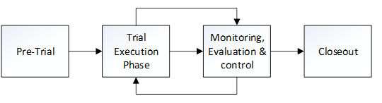
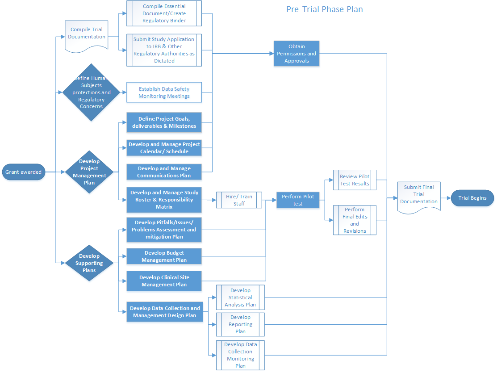
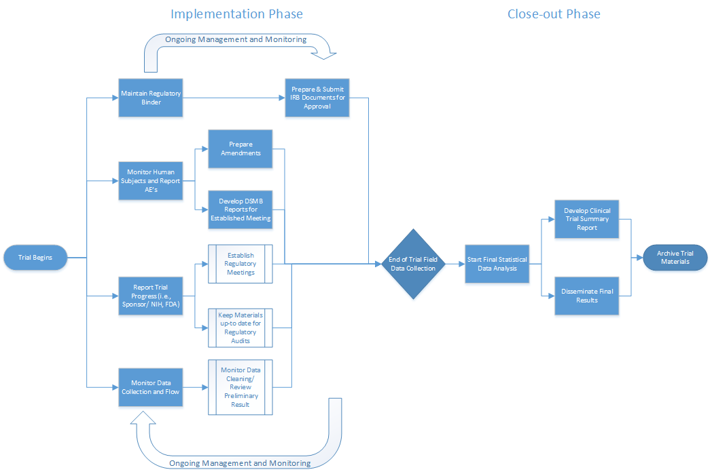
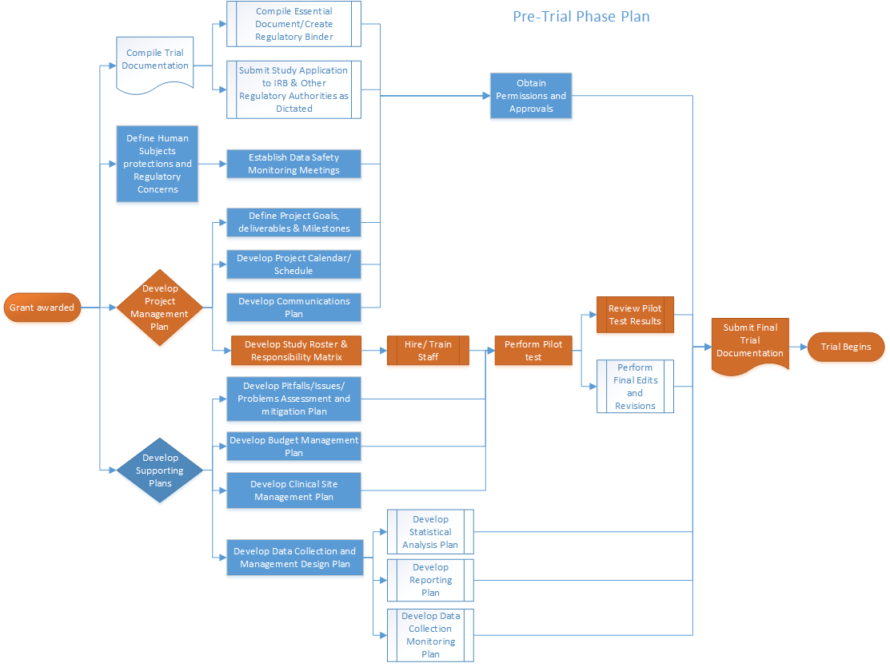

# Project Management

## Project management for Clinical trials

### What

Project management is the application of processes, methods, knowledge,
skills and experience to achieve the project objectives
(Warburton\_2014, PMBOk\_2013).

### Why

Given their complexity, Clinical Trials benefit from well-developed
project management plans and monitoring processes. In this module we
delineate provide guidance for management of funded clinical trial from
planning through execution and closeout.

### How

**Overview of the project management process **

For the purposes of management, it is useful to consider explicitly
three phases of the trial execution process: a pre-trial phase,
characterized by setup activities; the trial execution phase,
comprising those activities (enrollment, measurement etc.) that
constitute the major trial activities, and relying heavily on study
monitoring and evaluation; and a study closeout phase,
consisting of activities such activities as creation of final regulatory
reports, publication and archiving (Figure 5.1). Investigators
should anticipate a heavy investment of resources during the pre-trial
phase, but with proper planning this investment will pay dividends
during trial execution and closeout.

*Figure 5.1 Simplified temporal overview of the management process for
an intervention trial *

This module will briefly define the requirements and challenges for
project management for a clinical trial, and highlight potentially
helpful approaches and tools for each. Documentation; human subjects
concerns; development and use of a project management plan; management
of personnel and interpersonal communications; and diagnosis and
correction of problems will be discussed. For each of these, guidelines
and useful templates are provided. Given their critical importance,
activities embedded in the pre-trial phase are emphasized (see Figure
5.2).

*Figure 5.2. Example flowchart depicting high-level summary of Pretrial
activities and their order. In bold are the activities covered in this
module. For details click on each activity relevant to each trial phase.
*

*Figure 5.3. Example flowchart depicting high-level summary of trial
activities *

## Management of trial documentation (see [Essential Documentations Module](#Essential Documentations))

*Table 5.1 Project management activities relevant for trial
documentation presented by Phase

|**Trial Document/Activity** |**Pre-trial**  |**Execution**	|**Closeout**|
|--------------------------|:-------------------------------|:----------------------------|:---------------------------------|
|**Regulatory Binder**|Set up; establish location for storage and security  |Review/update and document changes on key trial documents  |Complete and archive regulatory binder|
|**Protocol**|Review and approval by relevant parties|Manage and document protocol amendments; obtain relevant approvals  |Archive all relevant documentation; submit to relevant authorities as necessary |
|**Credentials and competencies** |Gather research team documentation (i.e., resumes,onflict of interest forms, evidence of completion of required certifications) |Maintain study roster, record of competencies, and responsibilities chart |Archive| 
|**Investigator Brochure/Marketing**|Develop marketing materials/ investigators brochure|Manage and document updates; obtain relevant approvals| |
|**Manual of Procedures**  |Develop MOP; test procedures 	|Update and track changes throughout trial; maintain version control  |Archive |
|**Statistical Analysis Plan Statistical Analytic Protocol**  |Review SAP; generate signoff by relevant parties |Update and track changes throughout trial; maintain version control |Archive |
|**Data Safety and Monitoring Documents** |Author charter; recruit DSMB members, assign chairpersonship in partnership with funders |Circulate open and closed session reports at previously agreed upon interval prior to meetings. Submit to relevant authorities (e.g. DSMB, IRB, funding agencies) |Archive|
|**DSMB Report** |Develop template report; obtain relevant approvals|Update and track changes throughout trial; maintain   |Develop and disseminate final version control DSMB report; Archive |
|**Meeting Templates**  |Design meeting templates (agendas and minutes) |Co-author and maintain meeting records; disseminate key information| |
|**Tracking / Monitoring Reports** |Develop tracking and monitoring templates for enrollment, study visit attendance, protocol adherence, etc. |:Maintain record of findings as motivation for process improvement, changes to procedures and protocol amendments | |
|**Data Quality Reports**  |Develop reporting of data completeness and quality |Maintain record of findings as motivation for process improvement, changes to procedures and protocol amendments | |
|**Additional Documentation**|Develop study logs, documentation of adverse events, tracking of participant disposition, IRB submissions and approvals, etc. |Update and track changes throughout trial; maintain version control |Maintain and archive record of all relevant reporting|

## Management and maintenance of human subject protections and other regualtory interactions.

See [Essential Documentations](#Essential Documentations) and 
[Human Subject Protection and Research Regulation](#Human Subject Protection and Research Regulation) 
Modules. 

## Management of trials activities during pretrial and execution

### Creating a Project Management Plan

#### What

A Project Management Plan is a document that results in a dynamic set of
documents that clearly define the goals and provide direction for the
project. It articulates the specific deliverables, as well as
procedures, timelines, and resources necessary to produce those
deliverables, as well as quality measures to meet the required
standards. The plan should be based on the scope of the project as
defined in the protocol. The following tasks are critical to creating a
project management plan:

1.  Define the project goals/deliverables/milestones
2.  Management using outline-based and/or graphical tools for calendars
    and schedules
3.  Management of internal and external communications
4.  Management of project personnel and responsibilities

#### Why

A well-designed project plan increases the likelihood of successfully
managing a clinical trial. It supports coherent organization, effective
management, facilitates transparency, and the detection of foreseeable
problems/ issues via monitoring of the project’s critical path. The
process and subsequent documentation of all the project progress keeps
things focused and moving forward.

#### How

### Define project goals/ deliverables/ milestones

The project goals, deliverables and milestones are described in the
trial protocol. The protocol should be taken as the essential and
controlling guide implicating the relevant protocol management
activities.

#### Organizing structure

Project managers should be guided by an overarching structure. For
instance, in a large and complex trial with a large number of
deliverables, investigators and managers may utilize a formal Work
Breakdown Structure (WBS). The WBS is a hierarchical decomposition
list of necessary tasks, with each descending level representing an
increasing detailed definition of the work. Importantly, the WBS is
designed to be focused on generation of deliverables, i.e. tangible
work-product such as protocols, procedures and study reports. The WBS
provides a mechanism to parse deliverables into smaller manageable
components; the duration and cost of each step in the process can thus
be better established at a granular level.

For a smaller project, it may not be the case that a formal WBS is
necessary or efficient, but the detailed breakdown of specific tasks,
along with resources required, is almost never wasted effort. Thus the
following sections outline a system that is almost always relevant to
project management, but that may be adopted more or less formally as
circumstances dictate. The WBS can be developed using calendaring,
graphical and outlining tools.

### Management using outline-based calendars and schedules

A key component of the project’s success is the management of its
schedule. The project manager should:

-   Define all activities required to produce each of the project’s
    deliverables.
-   Define the order or sequence in which the activities must happen and
    the relationship between them.
-   Establish the resources (both human and material) necessary to
    accomplish each activity.
-   Estimate the activity duration.

These items may be applied both at the high level of the project –
where, for instance, “develop protocol” might be a single task – as well
as at the detailed level, where many tasks necessary to protocol
development may be broken out in detail. While the latter is a
substantial outlay of resources, it is important to note that the scope
of a task and the resources required are more easily estimated for
smaller sub-tasks. Accordingly the work invested in breaking out tasks
in detail may well be worth it in a complex project.

An example of a simplified schedule specific to protocol development is
given in Table X.3; task start and end dates, human resources, and other
materials would typically be added to this.

*Table 5.3 Example of a schedule specific to protocol development*

|**Activity Code** |  **Activity/ Deliverable** |**Duration (days)** |**Predecessor / Prerequisite**|
|------------------|:---------------------------|:-------------------|:---------------|
| {p style="text-align: center;"} </style> A 
 | Draft Protocol            | 30                 |             |
| {p style="text-align: center;"} </style> B 
 | Circulate Protocol Draft for Feedback and Input | 14   | A   |
| {p style="text-align: center;"} </style> C 
 | Integrate changes         | 18                 | B           |
| {p style="text-align: center;"} </style> D 
 | Circulate Draft Protocol for final Feedback and Input |14 | C  |
| {p style="text-align: center;"} </style> E 
 | Finalize Protocol         |8                  | D           | 
  

In the above example, the activities occur in a linear fashion where one
must precede the next. Other activities and tasks may more easily and
efficiently proceed along multiple, parallel tracks.

***Management using Graphical Tools***

Other management tools that may be helpful in creating the project
timeline or process maps include flowcharts, Gantt Charts, and network
diagrams. We present some examples of the use of these tools below.

**Flowcharts** - are graphical depictions of the process flow
corresponding to the outline format exemplified by Table 5.3. A
flowchart replicating Table 5.3 would consist of a series of boxes laid
out in boringly linear fashion and would therefore be of limited
utility. For more complex development along parallel tracks, by
contrast, a graphical depiction offers considerable advantages, as shown
in Figures 5.2 and 5.3. These flowcharts depict pretrial, execution and
closeout activities at a high level. Once again, each of the components
of the activities depicted here could itself be the subject of a
detailed tabular or graphical breakdown. A key strength of these
organizing tools is their applicability at the level of granular detail
and high-level project overview, simultaneously.

The **Network Diagram** is an enhanced flowchart that associates each
task with a duration and, potential, anticipated resource expenditures.
This is particularly useful in helping the investigative team understand
the impact of delays in any task on the overall timeline. Because many
tasks have prerequisites while others may be worked on in parallel, it
is not the case that delays in different tasks will have similar
impact.\
\
A useful concept, therefore, is the **critical path** of the project.
This is defined as the longest sequence of tasks stretching from project
start to finish. It has the feature that account for the fact that in
delays in any of the activities along the path will lead delay
completion of the project, unless this delay can be made up elsewhere
along the critical path. These concepts are illustrated in Figure 5.4.

*Figure 5.4. The project critical path is outline in orange; any delays
along this path imply an elongation of the total project duration. *

Management of internal and external communications

Key elements of the communications plan include:

**Opportunities for communication. **

The management team should assist in developing a schedule of
interactions between members of the investigative team, as well as with
internal and external stakeholders. This should include transmission of
formal reports, and also the times, locations, duration, and attendees
of meetings and other interactions.

**Means of communications.**

The management team should assist in procuring, testing and maintaining
the means of project communications. These should be chosen such that
capabilities correspond to project needs. Ease of use and reliability
are additional key features that must be emphasized.

**Recording of communications and trial progress. **

The project management team should take an active role in maintenance of
the record of communications, including meeting minutes and agendas.
Under some scenarios, stakeholders (e.g. funding agencies) may reserve
the right to determine the official level of high-level interactions, in
which case the management team may contribute as appropriate.

### Management of project personnel and responsibilities

The management team should develop a roster of personnel based on the
roles and responsibilities of team members. Ideally this will identify
the individuals primarily responsible (i.e. those that execute the work)
and accountable (i.e. those ultimately answerable for the completion)
for each function and task. Teams may additionally elect to identify
-those who have secondary responsibilities relating to consulting on, or
approval of, specific tasks and functions.

## Supporting plans

### Problem assessment and mitigation management plan

Every clinical trial is subject to problems that may impact the normal
progress of the project. Fundamental to the trial’s success is the
development of a comprehensive issues assessment and mitigation plan.
During the planning phase it involves the identification and
quantification of potential challenges that can impact (positively or
negatively) the trial and/or its progress. Based on the assessment, the
manager should develop a response plan. During trial phase the manager
is to monitor and control the possible issues. The purpose of a problem
assessment during the development stage of the trial is to first improve
the study design and to be able to successfully manage both the
foreseeable and unforeseeable problems.

#### Problem Management Response Plan

After identifying and evaluating potential problems that may impact the
trial, it is advisable to develop a problem management response plan.
The purpose is to develop response strategies to reduce the potential of
a problem to occur, or minimize its impact if it does. The main
components of the plan should include:

Issue management scope and objectives

The methods to identify, assess, quantify, response, monitor and control
the issue/ problem.

Personnel involved in the analysis and response processes.

The tools assigned to enhance opportunities and reduce threats to the
trial’s objectives.

Issue/problem prioritization (i.e., the level of impact to the schedule,
budget and/or quality of the trial results).

A response plan for tracking identified problems, monitoring the
residual issues, identifying new problems, and evaluating issues process
effectiveness throughout the trial.

Communications plan for the distribution of problem update reports.

The key for a successful problem management plan is to maintain a
constant monitoring and reevaluation of the potential problems as well
as the circumstances in which they emerge. As problems evolve
differently during different phases of the trials it is important to be
vigilant and be adaptable.

### Clinical site management plan

Another essential element of the clinical trial’s execution and its
success is the Site Management Plan. Site Management goes beyond simply
monitoring a site. It focuses on regular, consistent communication with
site stakeholders during the pre-trial, trial, and closeout phases. The
first step in the process is to identify a reliable, primary
point-of-contact for the site during the course of a trial. Is equally
vital that sites understand the importance of maintaining regular
communications with the primary study site or study Sponsor, depending
on trial type. Sites should also have a solid understanding of whom to
contact with questions, issues, and concerns that may arise at any point
during the trial.

The Site Management Plan should include a set of expectations,
organization, and the establishment of metrics to track performance, and
building and strengthen relationships. Table X.7 provides a list of
activities to undertake during the different phases of the trial.

*Table 5.7 Site Management Plan during the different phases of the
Clinical Trial*

  Pre-trial                                                                                                                                                 Execution                                                                                Closeout
  --------------------------------------------------------------------------------------------------------------------------------------------------------- ---------------------------------------------------------------------------------------- -------------------------------------------------------------------------------------------------------------------------------------------------------------------------------------------
  Define sample size (Krishnankutty\_2012) and recruitment strategies.                                                                                      Review/ monitor data collection issues.                                                  Complete final source data verification of Case Report Forms (CRFs/ eCRFs), ensuring protocol adherence, and managing the collection of final safety data.
  Review site feasibility and qualifications for the study.                                                                                                                                                                                          
  Define recruitment timeline.                                                                                                                                                                                                                       
  Establish Site contact/ develop relationships with sites.                                                                                                 Keep an updated list of staff turnover for the sites.                                    
  Create site training and provision of study documents for the in-service presentation (i.e., Introductory letters/ handouts/ brochures/ HIPAA waivers).   Re-in-service sites as often as needed (to keep momentum of the trial).                  
  Recruit sites.                                                                                                                                            Monitor site (remotely or on-site) according to regulations.                             Ensure all documentation (regulatory correspondence) is filed appropriately and ready for the clinical monitor or Clinical Research Associate (CRA) to review during the close-out visit.
  Follow-up site with phone calls to administrators and track those communications in a log.                                                                                                                                                         
  Hire/ Train/ Develop field staff.                                                                                                                                                                                                                  
  Set meeting schedule for the staff.                                                                                                                       Meet with staff weekly at first to problem solve. Then change to bi-weekly or monthly.   
  Develop site monitoring/Quality Assurance log                                                                                                             Update log                                                                               
  Define roles of study field staff vs. sites responsibilities.                                                                                                                                                                                      
  Inform sites on performance and contractual issues.                                                                                                       Track problems/ issues and their resolutions.                                            
                                                                                                                                                                                                                                                     Ensure return or destruction of all study related materials (i.e., unused lab kits and CRFs).

The appropriate level of site management and oversight empowers sites to
effectively recruit, treat, and retain subjects, while ensures
regulatory compliance, protocol adherence, the protection of subjects’
right, subject safety, and overall management of screened and enrolled
subjects. Presenting a clear understanding of the communication flow
will often reduce protocol violations and deviation, an address data
issues and questions, thereby increasing the quality and integrity of
the clinical trial data.

### Budget management plan

All financial aspects of the trial must be documented in an agreement
between the sponsor and the investigator/institution. A budget
management plan should aim to monitor the budget continuously as the
trial progresses given that delays and/ or changes on the trial’s scope
may negatively impact it. Scope creep or the tendency to add
requirements to the scope, often results in deliverables being out of
schedule and the trial being over budget. For this reason the budget
management plan should also include a routine schedule for revisions and
updates.

### Clinical Data Management Plan 

The design of the research data lifecycle should be strategized in the
clinical data management plan (CDMP). The exact content of the CDMP will
vary on the type of trial, the number of sites involved, and the
sponsor’s specifications. Among the recommended items to include are:

- Clinical data management definition and procedures

    - Systems for data collection and management

    - Data entry procedures

    - Data security procedures

    - Data cleaning and quality control procedures

    - Data import and exports procedures

    - Case Report Forms (CRF)

- Monitoring of study participants

    - Screening/Recruitment

    - Randomization/Blinding procedures

    - Cessation of Intervention

    - Withdrawals

    - Tracking

- Reporting

    - Safety

    - Adverse events and Serious Adverse Events

    - Screening and Enrollment

    - Data Quality and Completeness

    - Progress and Final Reports

    - Additional Reports

- Trial Documents and Data Retention

    - Retention of Trial Documents

    - Data Use Agreements (DUA)

For details see the Data management module. Other resources include
IFAR’s Sensitive Data Security Policy (IFAR\_sensitive\_data\_security),
Boston Children’s Hospital Guideline for Developing a Manual of
Operations (BCH\_RPG-05).

## Special considerations for older subjects
None

## Common Pitfalls

Lack of management follow-up and poor communications systems.

Failure to submit amendments or keep up with study documentation
updates.

Not keeping up with staff certifications.

Personnel turnover and a lack of redundancies buildup.

Lack of compliance with regulations.

Missing reports deadlines due to a lack of organization in the calendar.

Research sites closures during the trial collection cycle.

Unanticipated scope changes that affect the budget and schedule.

Ineffective recruitment.

Ineffective mechanism to maintain blinding.

Ineffective use of technologies.

Failure to update security systems.
