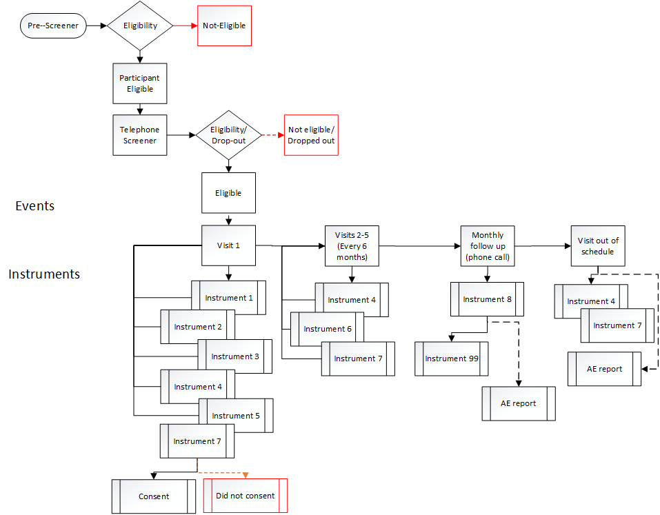

--- 
title: "A Clinical Trials Toolkit"
author: "The Interventional Studies in Aging Center (ISAC) 
at the Institute for Aging Research (IFAR)"
documentclass: book
link-citations: yes
site: bookdown::bookdown_site
---

\clearpage 

# Introduction

## Purpose of this Toolkit

This toolkit is a *general* guide for investigators and project staff at
Hebrew SeniorLife Institute for Aging Research (HSL IFAR) conducting,
managing or overseeing clinical trials in older populations. The toolkit
is not intended be a comprehensive document. Rather it is meant to
outline major considerations for all phases of a clinical trial.
Suggested resources are provided for more detailed information ** you
must consult and adhere to the latest federal, sponsor, institutional,
state and regional regulations.**

Whenever possible, sections of this toolkit follow a similar outline:
What, Why, How, Special Considerations for Aging Populations, Common
Pitfalls, and Resources.

## Are you Doing a Clinical Trial?

Below is the **National Institutes of Health [(NIH)**](https://grants.nih.gov/grants/guide/notice-files/NOT-OD-15-015.html) 
definition of a clinical trial. As clinical trials are subject to additional oversight,
a clear definition helps investigators ensure that they are meeting all
of their obligations, and help funders ensure that the additional
oversight is occurring when it is needed.

> A research study^1 ^in which one or more human subjects^2^ are
prospectively assigned^3^ to one or more interventions^4^ (which may
include placebo or other control) to evaluate the effects of those
interventions on health-related biomedical or behavioral outcomes.^5^
______________________________________________________________________

> ^1^See Common Rule definition of *research* at 45 CFR 46.102(d).
> 
> ^2^See Common Rule definition of *human subject* at 45 CFR 46.102(f).
> 
> ^3^*Prospectively assigned* refers to a pre-defined process (e.g., randomization) specified in a protocol that stipulates the assignment of research subjects (individually or in clusters) to one or more arms of a clinical trial.
> 
> ^4^An *intervention* is defined as a manipulation of the subject or subject’s environment for the purpose of modifying one or more health-related biomedical or behavioral processes and/or endpoints. Examples include: drugs/small molecules/compounds; biologics; devices; procedures (e.g., surgical techniques); delivery systems (e.g., telemedicine); strategies to change health-related behavior (e.g., diet, cognitive therapy, exercise); treatment strategies; prevention strategies; and, diagnostic strategies.
> 
> ^5^*Health-related biomedical or behavioral outcome* is defined as the pre-specified goal(s) or condition(s) that reflect the effect of one or more interventions on human subjects’ biomedical or behavioral status or quality of life. Examples include: positive or negative changes to physiological or biological parameters (e.g., improvement of lung capacity); positive or negative changes to psychological or neurodevelopmental parameters (e.g., mood management intervention for smokers; reading comprehension and /or information retention); positive or negative changes to disease processes; positive or negative changes to health-related behaviors; and, positive or negative changes to quality of life.

## Clinical Trial Phases

Clinical trials are conducted in a series of steps, called phases - each
phase is designed to answer a separate research question. These phases
mostly apply to trials testing drugs or devices, rather than behavioral
interventions.

-   **Phase I:** Researchers test a new drug or treatment in a small
    group of people for the first time to evaluate its safety,
    determine a safe dosage range, and identify side effects.

-   **Phase II:** The drug or treatment is given to a larger group of
    people to see if it is effective and to further evaluate
    its safety.

-   **Phase III:** The drug or treatment is given to large groups of
    people to confirm its effectiveness, monitor side effects, compare
    it to commonly used treatments, and collect information that will
    allow the drug or treatment to be used safely.

-   **Phase IV:** Studies are done after the drug or treatment has been
    marketed to gather information on the drug's/treatment’s effect in
    various populations and any side effects associated with
    long-term use.

## Training Requirements and Opportunities: 
Aside from clinical trial design and/or biostatistical training, there are varied practical,
short-term courses for principal investigators and project personnel to
enhance the conduct and rigor of their clinical trials.

1.  **Good Clinical Practice (GCP)** is an international quality
    standard that defines standards for clinical trials involving
    human subjects. The NIH require Certifications in Good
    Clinical Practice [(**GCP**)](https://grants.nih.gov/grants/guide/notice-files/NOT-OD-16-148.html#_ftn2_)
    for NIH-funded Investigators and clinical trial site staff who are
    responsible for the conduct, management and oversight of NIH-funded
    clinical trials. The [**FDA**](https://gcplearningcenter.niaid.nih.gov/Pages/default.aspx) has 
    a similar requirement.
    
    There are many other extensive courses offered to become GCP
    certified, both internet-based and on-site. Most have a
    tuition cost. It is a good idea, if resources are available, for
    Project Directors leading clinical trials to receive
    GCP certification. Below are examples of a few of these
    many opportunities.
    
    National Drug Abuse Treatment Clinical Trails Network [**(GCP)**](https://gcp.nihtraining.com/)
    Course.
    
    Online [**GCP**](http://www.onlinegcp.us/).
    
    Collaborative Institutional Training Initiative (CITI) 
    [**GCP**](https://www.citiprogram.org/index.cfm?pageID=90) Course.

2.  **Harvard Catalyst** [**Clinical Trial Design**](https://catalyst.harvard.edu/services/ctd/) 
    is an opportunity for new clinical investigators, who have an idea 
    for development of a clinical trial, to participate in an intensive
    eight-week course. It is offered at *no cost* to members of the
    Harvard Catalyst community or other Clinical and Translational
    Science Award(CTSA) usually in May/June, with an application due
    in March. Participants learn the fundamentals of clinical trial
    design, including instructions on how to design a protocol,
    information on IRB and regulatory topics, and on
    trial implementation. Additional course topics include statistical
    analysis, budgeting, and data management.

3.  **NIH Clinical Research** [**Training On-Line course**](http://crt.nihtraining.com) 
    is available 24/day at no cost with the following objectives: i. To raise
    awareness of the ethical issues involved in human subjects
    research; ii. To become familiar with the roles and responsibilities
    of the principal investigator and the institution when conducting
    clinical research in the NIH intramural research program; iii. To
    have an understanding of Food and Drug Administration (FDA)
    oversight of clinical research; and iv. To become familiar with how
    developments in science and health are reported by the media and how
    to work effectively with reporters.

4.  **Barnett International** Design and Conduct of Clinical Trials:
    [**Design Requirements, Statistical Issues, and Clinical Protocols**](http://www.barnettinternational.com/Live-Seminars/Design-and-Conduct-of-Clinical-Trials--Design-Requirements,-Statistical-Issues,-and-Clinical-Protocols/)
    is an on-site two-day course that provides an introduction to the
    scientific, statistical, and ethical aspects of clinical trials
    research. Cost (2016) = \$1800.

## Clinical Trial Planning Resources

Numerous resources are available to researchers as they plan and proceed
with their clinical trial.

1.  One such resources is The NIA Clinical Trial Toolbox: [**A resource
    for quality studies**](https://www.nia.nih.gov/research/blog/2016/10/nia-clinical-trial-toolbox-resource-quality-studies).
    This toolbox provides researchers with a central source of materials
    to develop and manage clinical trials. The site includes: templates,
    forms, guidelines and other related information that can be very
    helpful throughout the research process and is referenced throughout
    the ISAC toolkit.

<!--chapter:end:01_introduction.Rmd-->

# Experimental Design and Statistical Considerations

## Introduction

### What

Experimental design encompasses features of a clinical trial that relate to its structure and operations.

### Why

Careful planning and documentation of design of a clinical intervention study is critical for maintenance of rigor and the obtaining of results that are likely to be reproducible. These considerations are intimately connected to the trial's appropriateness for formal statistical analysis and production of results. It is thus imperative that all aspects of design receive the highest level of scrutiny during the planning phase.

### How

It is critical that aspects of design be tailored to the goals and specific aims of the trial. Below we delineate aspects of experimental and statistical design that should be considered. These are not to be considered comprehensive or as being equally applicable to all scenarios, but should provide a starting point in planning your study. 

## Design of the study

### What 

In this toolkit we consider explicitly randomized experiments conducted with human subjects, most typically clinical trials. 

### Why 

Key design features will ultimately dictate the internal validity and generalizability of trial results. 

### How 

The following items should be considered during the design phase.

1. _Rationale for conduct of the trial._ The scientific / biomedical impetus necessitating conduct of the trial. 
2. _Overall goal._ What, specifically, the study is intended to accomplish. Investigators should note the degree to which the trial will be considered **explanatory** (that is, focused on estimation of pure causal effects of intervention under controlled circumstances) versus **pragmatic** (focused on choosing between therapeutic options, often under circumstances mimicing or derived directly from clinical experience.) Many studies will have both explanatory and pragmatic aims. 
3. _Illness condition or state._ The condition modification of which motivates the study.
4. _Sampling population._ Individuals on whom sampling should focus, including explicit requirements for inclusion and factors that would preclude enrollment (exclusions).
5. _General approach to design._ Determination of the general nature of the approach to determining intervention efficacy and safety. For instance, the trial may be intended to demonstrate **superiority,** **noninferiority** or **equivalence** of a novel intervention to standard care; to determine **maximum tolerable dose** of a particular agent in a given population; to demonstrate a **dose-response** relation between intervention dosing and endpoints; etc. 
6. _Specific aims._ Detailed aims addressable by evaluation of statistical hypotheses.
7. _Primary and secondary endpoints._
8. _General nature of the planned comparisons._ Key features of the comparisons to be made; e.g. mean performance on a primary endpoint.
9. _Safety concerns._ Risks, including loss of confidentiality, affiliated with intervention or trial activities. Note that these will be explicitly considered by Institutional Review Board in assessing the risk/benefit ratio of conduct of the trial.
10. _Ethical considerations._ Additional safety of ethical considerations.
11. _Measurement and quantification of effects._ The way in which treatment effects will be quantified.
12. _Determination of statistical significance of comparisons._ Summary nature of quantitative comparisons, fleshed out in statistical analysis plan.
13. _Study staffing and environment._
    i. _Leadership._ Designation of membership and roles of investigative team leaders.
    ii. _Staffing._ Designation of study staff, with specific delineation of responsibilities.
    iii. _Environment._ Physical space in which the study will be conducted. Explicitly considers access and travel to and from the venue, as appropriate.
14. _Measurement._ Detailed explication of the was in which measurements will be taken. Makes specific note of resource needs (for instance, whether images or biospecimens must be collected or stored, and the equipment, facilities and human resources necessray to obtain said measures.)
15. _Nature and administration of intervention._ Specific detail on the intervention, including how, how frequently, and by whom it will be administered and monitored.
16. _Study intervention period._ Length of time over which intervention would be administered, including run-in and washout periods as applicable.
17. _Frequency of participant interactions, data collection and endpoint measurement._ Number and frequency of participant interactions and measurments; often displayed in tabular format.
18. _Participant allocation or randomization._ Methods by which participants will be assigned to trial arms, e.g. by randomization. Detail on the specific procedures used to determine these assignments. Must consider factors (e.g. blocking or stratification) that affect this process.
19. _Masking / blinding._ Determination of whether and how investigators, staff, participants, analysts etc. are aware of intervention assignments. 
20. _Data collection and management._ Detail on the physical systems for data capture, methods by which it will be captured, the persons performing entry, monitoring of data completeness and quality, etc (see [Data Management](https://ifar-isac.github.io/book/data-management.html) Module).
21. _Statistical design and sample size._ See below.
22. _Measurement of trial adherence._ Methods by which completeness of planned participant interactions with randomized activities will be quantified, and plans for analysis, if any.
23. _Training._ Provisions for training of study personnel, including human resources for providing the trainging.

### Special considerations for older adults

The number of participants available and who would likely consent to be enrolled in trials can be difficult to estimate among older individuals, particularly in the context of numerous exclusionary factors. 

### Common pitfalls

Lack of specificity in describing intervention; insufficient attention to the potential for attrition, data missingness, or intervention non-adherence; lack of detail in considering manner by which participants may be contacted, recruited, and maintained in the trial.

### Resources

## General Statistical Considerations 

### What

The statistical design works hand-in-hand with the experimental design to establish procedures for data interpretation and analysis. Major considerations include planning the enrollment and sample size, the general analytic approach, a priori consideration of the way in which results will be interpreted, and plans to resolve expected and unexpected problems, including data missingness and untoward measurements. 

### Why

Appropriate sample size and a statistical analysis plan are critical for the validity of conclusions and to prevent bias in operations and conclusions. 

### How

Derivation of the statistical analysis plan is detailed in the sections below. 

## Statistical Analysis Plan (SAP)

### What

The project Statistical Analysis Plan (**SAP**) provides detailed descriptions of statistical analyses to be conducted for the trial, including rationale for choice of methods, plans for dealing with unexpected difficulties, and pre-specified guidance on interpretation of results.

### Why

Guidance on data ascertainment, management, storage, analysis and interpretation are critical to preserve the validity of the design and soundness of scientific conclusions.

### How

A version of the SAP may be included as an addendum to or embedded within the study protocol and manual of procedures, but ideally the authoritative SAP should be an independent document with its own formatting, references etc. The SAP must be assembled prior to enrollment and approved by the appropriate parties including the trial statistician, investigative team, and regulatory authorities (e.g. DSMB), and may be included with the package submitted to Institutional Review Boards or equivalent overseeing ethical approval of the trial. Authorship should be by the project statistician, assisted by the investigative team. As with all trials documents, the SAP should be under strict version control, and a 'living' electronic date-stamped version considered the authoritative document (see 
[Essential Documentations](https://ifar-isac.github.io/book/essential-documentations.html) Module). 

#### Contents of the document

The contents of the SAP will vary from trial to trial. For a conventional intervention trial designed to assess efficacy, in which participants are allocated to one of two or more groups (e.g. intervention vs. control), contents might be as follows.

1. _Introduction._
      a. _Background._ Provides explanatory information concerning disease target, patient population, etc. Includes references to
      authoritative literature.
      b. _Objectives._ Briefly describes overall analytic goals.
          i. Primary objective. Describes primary objective of the trial, being specific concerning such matters as demonstration of
          feasibility; efficacy / effectiveness; safety. Provides some clarity concerning expected treatment effects and public health 
          relevance.
          ii. Secondary objectives. As above, for secondary objectives.
2. _Endpoints._
      a. _Primary endpoints._ Describes primary and secondary endpoints. May give detail as to measurement, validity and reliability, 
        and other performance characteristics.
      b. _Secondary endpoints._ As above, for secondary endpoints.
3. _Protocol / Grant SAP._ Summarize existing plan as presented in the original protocol or funding application.  
4. _Design elements._
      a. _Basic design features._ Discusses overall experimental structure for purposes of comparison.
          i. Nature of primary comparison. Describes the basic target of interest, i.e. determination of superiority, equivalence or 
          noninferiority of intervention to control or current standard of care.
          ii. Participant allocation. Describes randomization or other procedures by which participants are allocated to trial groups.
      b. _Schedule of events._ Gives a summary of time-points and measurements that will be used.
      c. _Blinding._ Describes the degree to which data scientists and personnel are blinded, and maintenance of same.
      d. _Blocking and stratification / matching._ Describes blocking, matching, etc. and references plans for consideration of design 
         effects in analysis.
      e. _Randomization Scheme._ Describes the randomization scheme and procedures.
      f. _Intended Sample Size._ Describes the intended final sample size, referencing potential hurdles such as attrition, crossover, 
         non-adherence and other sources of bias.
      g. _Effects intended to be estimated._ Describes inferential targets for the analysis.
          i. Bounds for determination of statistical significance. Gives clinical and statistical thresholds for determination of 
          significance of evidence and, where appropriate, rejection of null hypotheses.
          ii. Argument for clinical significance. Establishes clinical relevance of effect to be estimated, potentially using the 
          minimum clinically important difference or similar construct.
          iii. _A priori_ determination of interpretation of results.
5. _Analysis Populations / datasets._ Describes analysis populations.
      a. _Full analysis dataset._ Typically all enrolled participants.
      b. _Intention-to-treat dataset._ Typically all participants allocated to trial groups. Meant to simulate the effect of real-world 
      deployment of intervention.
      c. _Per-protocol dataset._ Typically participants meeting some bound on adherence to trial procedures. Meant to assess causal 
      effect of intervention under adherent conditions.
6. _Detailed Analytic Plan._ Presents the detailed project analytic plan. Where appropriate this may be organized by specific aim or project objectives.
      a. _Primary endpoint(s)._ Describe primary, supporting and exploratory analyses intended for the Primary Endpoint.
          i. Main analysis of primary endpoint(s). Describes controlling, primary treatment of main analysis.
          ii. Supportive analysis of primary endpoint(s). Describes secondary, supporting version of main analysis.
          iii. Exploratory analysis of primary endpoint(s). Describes additional, perhaps hypothesis-generating analyses, sensitivity 
          assessments, etc.
      b. _Secondary endpoint(s)._ Describe primary, supporting and exploratory analyses intended for the Secondary Endpoints.
          i. Main analysis of secondary endpoint(s). As above, for secondary endpoints.
          ii. Supportive analysis of secondary endpoint(s). As above, for secondary endpoints.
          iii. Exploratory analysis of secondary endpoint(s). As above, for secondary endpoints.
      c. _Safety analysis._ Present plan for analyses of safety signals. Refer to relevant guidance.
          i. Exposure to intervention and trial procedures.
          ii. Adverse events.
          iii. Deaths and Serious Adverse Events.
          iv. Other safety parameters.
      d. _Interim analysis._ Describe the rationale for and operationalization of planned interim analysis. Pay particular attention to 
      the objective – e.g. stopping for futility, demonstrated efficacy, etc.
          i.   Reasons for interim analysis. Briefly provide rationale.
          ii.  Objective of the interim analysis. Describe the objectives of the interim look.
          iii. Planned schedule of interim analysis. Provides the schedule and criteria by which this may be revised.
          iv.  Scope of potential adaptations. Describes ways in which the design may be altered as a result of the interim analysis.
          v.  Stopping rule. Provides the threshold, if any, of evidence that may result in early cessation of the trial for futility 
          and/or for early demonstration of efficacy or other reasons.
          vi. Adjustments to confidence intervals and p-values. Describes the method by which interim analyses will be acknowledged in 
          subsequent data presentations, including management of type-I error rates and related quantities.
          vii. Sample-size re-estimation and conditional power. Describes procedures for re-estimation and summary of conditional power 
          computations.
          viii. Documentation of interim analysis results. Provides template for presentation of results.
7. _Other methodological aspects._
      a. _Special considerations in measurement._ Here or elsewhere, addresses considerations such as measurement error, technical 
        considerations concerning, for instance, biomarker or imaging analysis, and other specialized considerations.
      b. _Quantification of adherence._ Considers whether adherence to trial procedures should be assessed and analyzed, and if so 
        provides the relevant planning.
      c. _Covariates and subgroups._ Gives descriptions of covariates and subgroups to be considered.
      d. _Handling of missing data._ Describes effect of attrition and other mechanisms dealing with missingness, and analytic plans 
        to take this into account.
      e. _Handling of outliers and unresolved queries._ Describes approaches to dealing with untoward values or unexplained 
        observations. May consider sensitivity analysis or other approaches; should be very specific and explicit.
      f. _Multiplicity adjustments._ Describes plans, if any, to deal with multiple comparisons issues.
      g. _Other considerations._
8. _Reporting conventions._ Describes manner in which results will be communicated; may include detailed instructions on units, significant digits and rounding, etc.

### Special considerations for older adults

Aging populations are subject to a number of factors that may induce bias or difficulty in analysis, including enhanced risk of attrition or competing risks, elevated prevalence of multimorbidity, difficulties with participant recall, and other factors [cite Van Ness et al]. These and related considerations must be carefully considered within the SAP and during analysis.

### Common pitfalls

Lack of specificity in describing techniques to be used and controlling decisions. Examples: failure to specify method by which standard errors are to be computed (model-based vs. robust. vs. resampling-based methods), failure to specify the set of covariates to be used in the definitive analysis (or method by which that set of covariates will be derived).

### Resources

## Presentation of Pre-planned Statistical Analyses

### What

Presentation of statistical analyses to collaborators within the trial can range from casual exploratory communications to formal presentation of results as described in the SAP. In general, formal inference should follow the pre-specified plan laid out in the SAP, with particular attention to maintenance of blinding and the potential for introduction of bias, and investigators should consult regulations and guidance as to the degree to which discussion of preliminary analyses by the investigative team are appropriate. Formal presentation of results should follow an established template consistent with the SAP and include critical elements as outlined below.

### Why

Protection against confirmation bias and other hazards is critical for the maintenance of rigor and validity of conclusions. Following the agreed-upon template for analyses (as documented in the SAP) provides this protection.

### How

Analyses should be presented in memoranda constructed in a reproducible fashion, with carefully managed version control and documentation of data sources and other items as described below. Authorship should be a collaboration between the study statistician and other members of the analytic team, and must have as a contributor the persons actually performing the analysis.

#### Contents of the document

Some critical items for inclusion are described below

1. _Introduction and objectives._ Brief background for the proposed analysis, with particular attention to measurement or design issues relevant to the presentation of results.
    a. _Data Sources._ Describes the studies and data set/s used. Must specify the version of the data structures (i.e. the date upon which the dataset was frozen and/or transmitted to the analyst.
    b. _Software and computing environment._ Describes the analytic tools and machinery employed, including version numbers.
    c. _Aims and Analysis Objectives._ Briefly states the aims and hypothesis of the analysis. Includes a brief prose summary how each aim was addressed in the analyses.
2. _Methods._ Describes analytic sample and methods employed.
    a. _Analytic samples and timeframe._ Defines samples used. Specifies any subgroups to be used in analysis.  Specifies the analysis timeframe (i.e. which visits or measurements were incorporated in analysis).
    b. _Outcome measures._ Specifies the primary and secondary outcomes used in the analysis. If outcomes are derived, provides clear definitions in natural language. Specifies the timepoints at which measures were obtained if not obvious from text above.
    c. _Control Variables._ Lists covariates used in the analyses. Where variables were derived, provide clear definitions. Specifies the timepoints at which measures were obtained, if not obvious from above.
    d. _Statistical Procedures._ Provides the types of statistical methods/models used as well as any statistical tests performed specific to each analytic aim identified above. Identifies primary, supporting and exploratory analyses (see Section XXX).
    e. _Sensitivity Analysis._ Describes and justifies any sensitivity analyses, i.e. using different samples, covariates, methods/models, etc.
    f. _Treatment of missing data._ Describes methods by which missing data are acknowledged and/or taken into account.
    g. _Deviations from SAP or secondary analytic plan._ Describes and justifies any variation in approach from that previously planned.
3. _Presentation of Results._ Formal presentation of results. Should track closely with [SAP](https://ifar-isac.github.io/book/experimental-design-and-statistical-considerations.html#statistical-analysis-plan) or secondary analytic plan as well as the sections described in Methods (above).
4. _Conclusions._ Provides in prose the overall implications of the analysis, with high-level quantitative summaries as appropriate.

### Special considerations for older adults

See Special considerations for older adults under the [Statistical Analysis Plan](https://ifar-isac.github.io/book/experimental-design-and-statistical-considerations.html#special-considerations-for-older-adults-1) section.

### Common pitfalls

Failure to acknowledge data sources or describe methods with sufficient detail; failure to conduct and document conclusions in reproducible fashion.

### Resources

## Planning, Conduct and Presentation of Secondary Analyses

Following or in parallel to completion of pre-planned analyses, secondary analyses may be requested or conducted. It is recommended that the trial employ a template for request and design of these analyses that mirrors the structure of the report described in the [Contents of the document](#contents-of-the-document-1) section.

## References
^1^Van Ness, P.H., V.R. Towle, and M. Juthani-Mehta (2007) Testing Measurement
Reliability in Older Populations: Methods for Informed Discrimination in Instrument Selection and 
Application. *Journal of Aging and Health* (20) 2: 183-197. DOI: [10.1177/0898264307310448](http://citeseerx.ist.psu.edu/viewdoc/download?doi=10.1.1.1028.3797&rep=rep1&type=pdf).

Van Ness, P.H., T. E. Murphy, and A. Ali (2016) 
Attention to Individuals: Mixed Methods for N-of-1 Health Care Interventions.  
Journal of Mixed Methods Research DOI: [10.1177/1558689815623685](https://doi.org/10.1177/1558689815623685).

<!--chapter:end:02_Experimental_Design_and_Statistical_Considerations.Rmd-->

# Human Subject Protection and Research Regulation

## Introduction
### Module Goal
The goal for this module is to introduce the essential elements of human
subjects’ protections and regulatory requirements pertinent to the
conduct of clinical trials. Essential aspects of human subjects’
protections and regulatory requirements provided in this module include:

-   Institutional Review Boards.
-   Health Insurance Portability and Accountability Act (HIPAA).
-   Data Use Agreements (DUA).
-   ClinicalTrials Registration.
-   Data Safety Monitoring.
-   Informed Consent.
-   Adverse Event Monitoring and Reporting.

### General Considerations About Federal Regulations

The regulation of clinical trials can be complex. What may be seen by
investigators as trivial regulations or minor misdemeanors can have
serious consequences for the individual investigator, their
institutions, sponsors, and trial subjects. Therefore, it is wise to be
over-cautious and anticipate problems before they arise. **As regulatory
issues can play a critical role in your trial design, it is strongly
advised to consider these issues from the very start of project planning
(e.g. grant preparation) by consulting with your Institutional Review
Board (IRB), and making sure you understand existing regulations and
institutional policies.**

Federal agencies including the U.S. Food and Drug Administration (FDA)
and the Department of Health and Human Services (HHS), which includes National
Institutes of Health (NIH), make and enforce regulations to ensure the
safety of participants in clinical trials, and retain final authority
for determining whether an institution has been compliant.
**Investigators should review the specific regulations of the funding or
over-seeing agency and confer with the IRB to determine whether
additional regulations or policies apply. The investigator must keep in
mind that when more than one regulation, guidance, or policy applies the
most stringent must be followed.**

*HHS regulated trials (includes NIH):* HHS requirements for federally
funded human subjects’ research is codified in [45 CFR Part 46
“Protection of Human Subjects”](http://www.hhs.gov/ohrp/regulations-and-policy/regulations/45-cfr-46/).
This set of regulations are based on the [Belmont
Report](http://www.hhs.gov/ohrp/regulations-and-policy/belmont-report/).

*FDA Regulated Trials:* The FDA has their own set of human subject
regulations and regulations CFR – Code of Federal Regulations Title 21
governing IRB activities, which goes beyond the scope of this module. A
key initial step is to determine whether or not your trial falls under
the regulatory jurisdiction of the FDA which generally oversees drug and
device trials. For more information check [FDA
regulations](http://www.fda.gov/ScienceResearch/SpecialTopics/RunningClinicalTrials/ucm155713.htm).

*Office of Human Research Protections (OHRP):* The OHRP is the federal
body responsible for compliance monitoring. Under Title IV of the Public
Health Service Act (42 USC 281 et seq.), OHRP has the authority to
investigate complaints about human subject protections in HHS-funded
research, or other research covered by the institution’s Assurance of
Compliance. For general regulatory issues, particularly for federally
funded trials, refer to the [OHRP website](http://www.hhs.gov/ohrp/).

*International Conference on Harmonization (ICH) Good Clinical Practice
(GCP):* While federal regulations provide the standards by which human
subjects research is to be conducted, guidance documents and
institutional policies add specificity and provide direction on how to
apply regulatory requirements. One such guidance is the ICH GCP guidance.
Compliance with the [ICH GCP](http://www.ich.org/products/guidelines/efficacy/article/efficacy-guidelines.html) 
assures that the rights and well-being of trial subjects are protected and 
that the clinical trial data are credible.

### Resources
-   Code of Federal Regulations, Title 45 Part 46,<http://www.hhs.gov/ohrp/regulations-and-policy/regulations/45-cfr-46/>
-   Belmont Report,
    <http://www.hhs.gov/ohrp/regulations-and-policy/belmont-report/>
-   International Conference on Harmonization (ICH) guidelines for Clinical Good Practice (GCP),
    <http://www.ich.org/products/guidelines/efficacy/article/efficacy-guidelines.html>
-   OHRP, <http://www.hhs.gov/ohrp/>
-   US Food and Drug Administration regulations,
    <http://www.fda.gov/ScienceResearch/SpecialTopics/RunningClinicalTrials/ucm155713.htm>

## Institutional Review Board (IRB)
### What

An Institutional Review Board (IRB) is an appropriately constituted
group formally designated to review, approve and monitor research
involving human subjects to ensure it is conducted in accordance with
applicable federal regulations, institutional policies, and ethical
guidelines.

While all IRBs are responsible to adhere to the same regulations as
defined by [OHRP](http://www.hhs.gov/ohrp/regulations-and-policy),
each IRB is required to have its own institutional policies and operates differently. It is
critical to understand the requirements of the IRB overseeing your
project. Specific information relevant to HSL IRB can be found on the
IRB section of the [HSL
website](http://www.instituteforagingresearch.org/resources/research-administration/institutional-review-board)
as well as the internal HSL [“HUB”](http://thehslhub/Departments/Roslindale/HSL-IFAR/Institutional-Review-Board).

#### Categories of IRB oversight

Depending on the study design and degree to which human subjects are
involved, the IRB will review the research and will make a determination
on the appropriate review level. The basic levels of review include:

-   Exempt (determination by IRB Chair or her designee).
-   Expedited (review/approval by IRB Chair or her designee).

Full Board (review/approval by the convened IRB) Most clinical trials
will require full IRB review.

#### IRB applications and reviews

IRB applications include:

-   Initial application.
-   Annual/continuing review.
-   Amendments/modifications to the protocol or study materials.
-   Incident reports for:
    -   Unanticipated problems.
    -   Non-Compliance.

##### Initial review of research application

All human subjects’ research must be reviewed and approved by an IRB
before human subjects activities can begin. This includes recruitment
efforts, and receiving or collecting data. Per Federal and Institutional
policy, no funds for research involving human subjects activities will
be released until the appropriate IRB approval has been secured.

##### Annual/Continuing review

Investigators must receive continuing approval of their research at
least annually. On some occasions, more frequent review may be required
by the IRB. Continuing approval is required until all activities with
human subjects are complete (this includes access to data with
participant identifiers or with codes that can be linked back to
research participants).

##### Amendment submissions

Investigators must submit all changes to the research or research
materials and receive IRB approval for those changes prior to
implementation (except when necessary to eliminate apparent immediate
hazards to research participants).

### Why

The IRB assures that a clinical trial is in compliance with federal and
state regulations, institutional policies, and accepted ethical
guidelines, to protect the rights and welfare of research subjects.

### How

#### IRB review for single site trials

The procedures for IRB review differ by institution but have common main
elements. It is wise before you embark on your IRB application to
consult with the IRB office to review the general study design and
anticipate key review considerations.

The HSL IFAR IRB uses an electronic submissions system (Cayuse). Forms
are templated and will guide you through the required elements.
Application submissions must meet deadlines stipulated in the [HSL IFAR
IRB Standard Operating Procedures](http://thehslhub/~/media/HSLNet/Docs/IFAR/IRB/IRB_SOP.ashx).

#### IRB review for multi-site trials 

Many clinical trials involve multiple sites and/or investigators from
multiple institutions. Many clinical trials involve multiple sites that
are clearly engaged in human subjects’ research (i.e., site personnel
are recruiting subjects, implementing an intervention, or collecting
data). Regulatory oversight of these trials can be done either by:

-   Single IRB review (one IRB reviews the research, and the other IRBs
    rely on the reviewing IRB).
-   Multiple IRB reviews (e.g. each institution conducts its own
    IRB review/approval).

In June 2016, the NIH established a
[policy](http://grants.nih.gov/grants/guide/notice-files/NOT-OD-16-094.html)
effective May 25, 2017, requiring a single IRB for all NIH-funded
multisite studies, with only rare exceptions.

IRBs of engaged sites and investigators may cede oversight
responsibility to the IRB reviewing the research (also referred to as
the IRB of record). Relying on an external IRB, or ceded review, is
documented with a formal agreement between the reviewing and relying
site IRBs and must be signed by an Institutional Official. Note: If you
are conducting research with Harvard affiliates, you may rely on the
Harvard Catalyst Reliance Agreement, rather than an IRB Authorization
Agreement. See the HSL IRB office for more information.

Some study sites engaging in human subjects’ research (e.g., community
nursing homes) may not be associated with an IRB. In this case the
reviewing IRB may agree to provide IRB oversight for the external site
through a formalized agreement (Individual Investigator Agreement)
between the two parties. Alternatively, a commercial IRB may be engaged
in a contract to provide oversight for that external site. Sites that
receive direct federal awards for research purposes may also need a
[FederalWide Assurances](http://www.hhs.gov/ohrp/register-irbs-and-obtain-fwas/fwas/fwa-protection-of-human-subjecct/index.html).
These determinations will be made by the prime IRB responsible for the trial.

### Special Considerations for Older Subjects

There are two special considerations for special protections governing
research with elderly subjects: cognitive impairment and
institutionalization. Under those conditions, a number of issues must be
taken into consideration. See [OHRPs related guidance](http://archive.hhs.gov/ohrp/irb/irb_chapter6.htm) and [HSL IRB’s
Standard Operating Procedures (SOPs)](http://thehslhub/~/media/HSLNet/Docs/IFAR/IRB/IRB_SOP.ashx). See
also [Informed Consent](https://ifar-isac.github.io/book/human-subject-protection-and-research-regulation.html#informed-consent) related to the decision making capacity.

### Common Pitfalls

-   Not seeking IRB guidance in the process of trial design and well in
    advance of your planned start date.
-   Underestimating the time it takes to get IRB approval.
-   Underestimating regulatory requirements. Failure to meet
    requirements could lead to serious consequences for yourself and
    your institution. Be overly cautious and always report anything of
    potential concern to your IRB.
-   Flippant or casual comments about human subjects’ or regulatory
    issues about your trial via emails or text. If a problem occurs, all
    related communication may be become eventually become relevant.

### Resources 
External

-   HHS OHRP Regulations and Policy, <http://www.hhs.gov/ohrp/regulations-and-policy/guidance/index.html>
-   NIH Policy on the Use of a Single IRB for Multi-site Research, <http://grants.nih.gov/grants/guide/notice-files/NOT-OD-16-094.html>
-   U.S. Food and Drug Administration (FDA), <http://www.fda.gov/ScienceResearch/SpecialTopics/RunningClinicalTrials/>

Internal

-   HSL IRB, <http://www.instituteforagingresearch.org/resources/research-administration/institutional-review-board>
-   HSL “HUB”, <http://thehslhub/Departments/Roslindale/HSL-IFAR/Institutional-Review-Board>
-   HSL IFAR IRB Standard Operating Procedures, (<http://thehslhub/~/media/HSLNet/Docs/IFAR/IRB/IRB_SOP.ashx>)

## The Health Insurance Portability and Accountability Act (HIPAA)
### What 
The HIPAA, enacted through the Privacy Rule, establishes national
standards for the protection of protected health information (PHI). The
rule establishes conditions under which PHI may be used by covered
entities^1^, including for research^2^ purposes. With regards to
research, the Privacy Rule also defines the means by which individuals
should be informed of uses of their medical information for research
purposes, and their rights to access information about them held by
covered entities.

^1^***Covered entities**: health plans, health care clearinghouses and
health care providers who transmit any health information in connection
with transactions for which HHS has adopted standards.*

^2^***Research**: Defined in the Privacy Rule “a systematic
investigation, including research development, testing, and evaluation,
designed to develop or contribute to generalizable knowledge.” *

### Why

The Privacy Rule protects the privacy of individually identifiable
health information, while at the same time ensuring that researchers
have access to medical information necessary to conduct vital research.

### How

The [Privacy Rule](http://www.hhs.gov/hipaa/for-professionals/privacy/) builds upon the
protections provided to human subjects in the [Common Rule (45 CFR Part
46, Subpart A)](http://www.hhs.gov/ohrp/regulations-and-policy/regulations/common-rule/), and/or the Food and Drug Administration’s (FDA) human subject protection regulations [(21 CFR Parts 50 and 56)](http://osp.od.nih.gov/office-clinical-research-and-bioethics-policy/clinical-research-policy/research-involving-human-subjects). There are three main areas for researchers to consider.

#### Screening patients for recruitment 

Selection of subjects for a clinical trial often requires identifying
patients with specific characteristics (e.g., a diagnosis) from a large
patient population using data considered PHI. To facilitate such
efforts, covered entities are permitted to use and disclose PHI for
research purposes pursuant to a waiver of authorization by an IRB or
Privacy Board. At HSL, the IRB also serves as the Privacy Board.

#### Inclusion of HIPAA assurances in informed consent forms

When PHI is being used in a research study, the consent form must
include core elements and essential language for authorization of use of
PHI as defined by the Privacy Rule (see Privacy Rule, 45
C.F.R. §164.508(c)(1)). At HSL, the required language is included in the
Informed Consent Template available in the online IRB application system
Cayuse. **Investigators should not alter these templates without
consulting the IRB.**

#### Handling of PHI throughout the trial

A core tenant of HIPAA and the use of PHI is to use the minimum
necessary information in order to maintain and protect patient privacy.
As such, clinical trials must be designed and conducted to minimize
unnecessary data collection and maximize subject confidentiality.
Whenever possible, information obtained from patients or their medical
records should be collected without identifiers. When identifiable data
is collected, the protocol must be designed to maintain confidentiality
of identifiable data, and data security measures appropriate to the
degree of risk from disclosure.

A complete summary of key elements of the Privacy Rule including who is
covered, what information is protected, and how PHI can be used and
disclosed is presented in the “[Summary of the HIPAA Privacy
Rule](http://www.hhs.gov/hipaa/for-professionals/privacy/laws-regulations/index.html).
HSL-specific policies regarding HIPAA, and the use of PHI in research
can be found in the [HSL IRB
SOP](http://thehslhub/~/media/HSLNet/Docs/IFAR/IRB/IRB_SOP.ashx). 

### Special considerations for older subjects
NONE

### Common Pitfalls
-   Inadequate protection PHI (e.g., transporting patient files with
    identifiers in an unsecure manner, unencrypted laptops or databases
    that contain PHI etc).

### Resources 

-   Regulatory/Policy, Food and Drug Administration’s (FDA) human subject protection regulations (21 CFR Parts 50 and 56),<http://osp.od.nih.gov/office-clinical-research-and-bioethics-policy/clinical-research-policy/research-involving-human-subjects>
-   HHS Code of Federal Regulations HIPAA for Professionals, <http://www.hhs.gov/hipaa/for-professionals/special-topics/research/index.html>
-   HHS Summary of the HIPAA Privacy Rule, <http://www.hhs.gov/hipaa/for-professionals/privacy/laws-regulations/index.html>
-   HHS Protecting Person Health Information in Research: Understanding HIPAA Privacy Rule, <https://privacyruleandresearch.nih.gov/pdf/HIPAA_Privacy_Rule_Booklet.pdf>
-   HHS NIH, HIPAA Authorization for Research, <https://privacyruleandresearch.nih.gov/authorization.asp>.
-   Common Rule (45 CFR Part 46, Subpart A), <http://www.hhs.gov/ohrp/regulations-and-policy/regulations/common-rule/>

Internal

-   HSL IRB SOP, <http://thehslhub/~/media/HSLNet/Docs/IFAR/IRB/IRB_SOP.ashx>

## Data Use Agreements (DUA)
### What 
A data use agreement (DUA) is a contractual agreement required under the
Privacy Rule between a HIPAA covered entity (e.g., HSL) and a third
party who wishes to obtain PHI with limited identifiers, referred to as
a Limited Data Set (LDS). DUAs address issues such as limitations on use
of the data, obligations to safeguard the data, liability for harm
arising from the use of the data, publication, and privacy rights that
are associated with transfers of confidential or protected data. Refer
to HIPAA, [Section 45 CFR part 160 Subparts A and E of Part
164](http://www.hhs.gov/ocio/eplc/EPLC%20Archive%20Documents/55-Data%20Use%20Agreement%20(DUA)/eplc_dua_practices_guide.pdf)
for details. A common example of a study that requires a DUA, is one
that utilizes Medicare data for which a DUA must be set up with the
Centers for Medicare and Medicaid. See resources below for guidance.

### Why
In addition to the requirements set forth in the Privacy Rule, a DUA
clearly establishes the rules and expectations related to provision and
use of data by the involved parties (provider and recipient). DUA must
be entered into *before* there is any use or disclosure of a limited
data set to an outside institution or party.

### How
The content, format, and processes of establishing DUAs differ depending
on the entities involved. Investigators must use approved DUA frameworks
at these entities and their institutions. [HSL IFAR policies related to
DUAs](http://thehslhub/~/media/HSLNet/P_P/IFAR/IFARPPCMS.ashx) can be
found on the HUB.

### Special considerations for older subjects 
NONE

### Common Pitfalls
-   Not realizing a DUA is needed.
-   Being unaware the time required to process a DUA, especially with CMS.
-   Being unaware the cost required to use data from certain entities,
    especially CMS.
-   Narrowly written DUAs which do not account for the possibility of
    future analytic plans.

### Resources 

External

-   Academy Health, Privacy Tools: Guidance on HIPAA Data Use
    Agreements, <http://www.hsrmethods.org/PrivacyInResearch/Privacy%20Tools/Guidance%20on%20HIPAA%20Data%20Use%20Agreements.aspx>
-   CMS.gov DUAs, <https://www.cms.gov/Research-Statistics-Data-and-Systems/Computer-Data-and-Systems/Privacy/DUAs.html>
-   HHS CMS DUA, Agreement for use of Centers for Medicare and Medicaid
    Services (CMS) Data containing individual identifiers,
    <https://www.cms.gov/Medicare/Medicare-Fee-for-Service-Payment/sharedsavingsprogram/Downloads/Data-Use-Agreement.pdf>
-   HHS NIH, How can Covered Entities Use and Disclose Protected Health
    Information for Research and Comply with the Privacy Rule?,
    <https://privacyruleandresearch.nih.gov/pr_08.asp>
-   HHS Practice Guide Data Use Agreement,
    <http://www.hhs.gov/ocio/eplc/EPLC%20Archive%20Documents/55-Data%20Use%20Agreement%20(DUA)/eplc_dua_practices_guide.pdf>
-   Research Data Assistance Center, Tips for completing the Data
    Use Agreement with Addendum, <http://www.resdac.org/resconnect/articles/154>

Internal

-   Hebrew Senior Life, Creation, Use, Disclosure and Receipt of
    Limited Data Sets and Data Use Agreements doc, <http://thehslhub/~/media/HSLNet/P_P/IFAR/IFARPPCMS.ashx>

## Clinical Trial Registration
### What
ClinicalTrials.gov is an on-line public registry of clinical trials
maintained by the U.S. National Institutes of Health (NIH) and National
Library of Medicine. It was launched in 2000 and expanded by the Federal
Drug Administration Amendment Act (FDAAA 801) in 2007 and is endorsed by
the International Committee of Medical Journal Editors (ICMJE).

#### Which trials must be registered?

It is strongly recommended that **ALL** clinical trials are registered on
[ClinicalTrials.gov](https://clinicaltrials.gov/). By law, only trials that meet the FDAAA 801
definition of an "applicable clinical trial" must be registered which
generally include interventional studies (with one or more arms) of
FDA-regulated drugs, biological products, or devices. However, in 2014,
the NIH proposed expanding clinicaltrials.gov registration requirements
to include all NIH-funded clinical trials. Thus, even clinical trials in
which the intervention is a behavior modification or clinical education
program merits registration on ClinicalTrials.org. **It is strongly
recommended that ALL clinical trials are registered on
ClinicalTrials.gov.**

### Why
There are numerous reasons for registering a trial. Refer to [Clinicaltrials.gov]((https://clinicaltrials.gov/ct2/manage-recs/background) for elaboration.

#### Required by Law
Section 801 of the Food and Drug Administration Amendments Act [(FDAAA
801)](http://www.gpo.gov/fdsys/pkg/PLAW-110publ85/pdf/PLAW-110publ85.pdf#page=82)
requires Responsible Parties to register and submit summary results of
clinical trials with ClinicalTrials.gov. The law applies to certain
clinical trials of drugs (including biological products) and medical
devices.

#### Required for Journal Publication
The International Committee of Medical Journal Editors [(ICMJE)](http://www.icmje.org/recommendations/browse/publishing-and-editorial-issues/clinical-trial-registration.html) requires trial registration
as a condition of the publication of research results generated by a
clinical trial. ClinicalTrials.gov is a registry where organizations and
individuals can provide the World Health Organization (WHO) [Trial
Registration Data
Set](http://www.who.int/ictrp/network/trds/en/index.html) required by
ICMJE. Top tier journals will scrutinize the registration of your trial
on ClinicalTrials.gov and make sure that is aligns with the description
provided in your paper. **Most journals have a strict requirement that
your trial be registered no more within 21 days after enrollment of the
first participant and will reject your paper it is this is not the
case.**

### How

Trial registry is done on the ClinicalTrials.gov. Protocol Registration
and Results System (PRS). The PI (and in some circumstances, a lead
person on the study team) should be assigned as the Responsible Party
charged with initiating and maintaining the registration. Once submitted
by the PI, institutional administrators (the HSL IRB Director at IFAR)
are notified of the submission and must verify the information in the
registration (including changes and updates to the study) and approve
and release it before it is sent to administrators at ClinicalTrials.gov
for review and eventual posting.

#### Initial submission

The clinical trial must be registered no later than 21 days after
enrollment of the first participant. Note this rule is strictly enforced
by major journals. If initial registration is not done within this
timeframe, the trial results will be disqualified from consideration for
publication. The application and direction are online at [ClinicalTrials.gov](https://clinicaltrials.gov/ct2/manage-recs/how-apply).

#### Registration Updates

Responsible Parties should update their records within 30 days of a
change to any of the following:

-   [Recruitment
    Status](http://prsinfo.clinicaltrials.gov/definitions.html#FacilityStatus)
    and [Overall Recruitment
    Status](http://prsinfo.clinicaltrials.gov/definitions.html#OverallStatus)
    data elements.
-   Completion Date.
-   Outcomes Definitions.
-   Other changes or updates to the record must be made at least every
    12 months.

#### Submitting Results
The Responsible Party MUST submit summary results no later than 12
months after the Completion Date, defined in as the date of final data
collection for the pre-specified "primary outcome measure" (see [Primary
Completion Date data
element](http://prsinfo.clinicaltrials.gov/definitions.html#PrimaryCompletionDate)
on ClinicalTrials.gov). Scientific information is submitted as [four
separate modules](https://clinicaltrials.gov/ct2/manage-recs/how-report\#Overview): Participant Flow, Baseline Characteristics, Outcome
Measures and Statistical Analyses, and Adverse Events.

### Special considerations for older subjects 
NONE

### Common Pitfalls
-   Failing to register the trial.
-   Failing to register the trial within a 21 days of enrolling the
    first participant.
-   Failing to maintain and update trial registration details.
-   Failing submit results.

### Resources 

-   ClinicalTrials.gov,
    <https://grants.nih.gov/ClinicalTrials_fdaaa/docs/registration_flow_chart.pdf>
-   World Health Organization (WHO), <http://www.who.int/about/en/>

## Data Safety Monitoring
### What
Funding agencies require that the safety of trial participants and
integrity of data are ensured through systems of research oversight and
monitoring. The type and level of monitoring required depends on the
risk, nature, size and complexity of the clinical trial. It can be as
simple as basic monitoring by the PI, an independent safety officer or
medical monitor, or an NIH officer, or as complex as a full independent
Data Safety Monitoring Board (DSMB). **The decision about the level of
data safety monitoring required for your study is ordinarily determined
by the sponsor (i.e., NIH), but it may also be required by the IRB.**
The remainder of this module assumes your trial requires full DSMB.

The DSMB is a formally appointed independent group, consisting of at
least three (3) voting members external to the research that typically
include experts in the relevant field of study, statistics, and study
design. The clinical trial PI(s) and lead statistician also typically
participate as internal members on the DSMB.

The DSMB conducts interim monitoring of accumulating data from research
activities to assure the continuing safety of human subjects, relevance
of the study question, appropriateness of the study, and integrity of
the accumulating data.

### Why
The purpose of a DSMB is to ensure the safety of human subjects,
relevance of the study question, appropriateness of the study, and
integrity of the accumulating data. Additionally, the DSMB attempts to
identify threats to credibility or the validity of the study related to
slow rates of accrual, high rates of ineligibility after randomization,
high rates of protocol violations, and unexpectedly high dropout rates.

The primary responsibilities of the DSMB are:

-   Periodic review and evaluation of the accumulated study data for
    participant safety, study conduct and progress, and, when
    appropriate, efficacy.
-   Provision of written documentation confirming review of the protocol
    and agreement with the study design and the data safety monitoring
    plan (DSMP).
-   Make recommendations to study sponsor concerning the continuation,
    modification, unmasking or termination of the trial.
-   Provide a written report to the IRB which summarizes oversight
    activities and recommendations, and any concerns regarding
    subject safety.

### How
There are four basic steps in establishing a trial’s Data Safety Monitoring system:

#### Establish a Data Safety Monitoring Plan (DSMP)

The PI should create a Data Safety Monitoring Plan (DSMP) that is
appropriate for the type and expected risks of the research. The DSMP
must be included with the protocol in the initial submission to the IRB.
[Templates of
DSMPs](https://www.nia.nih.gov/research/dgcg/clinical-research-study-investigators-toolbox/data-and-safety-monitorin)
are available on the NIH website*. DSMPs* generally include the
following elements:

-   Data or events to be captured under the monitoring provisions (e.g.,
    unanticipated problems and adverse events).
-   The entity responsible (e.g., investigators, sponsor, a coordinating
    or statistical center, an independent monitor, DSMB) for monitoring
    the data collected and the time frames for reporting.
-   The frequency of assessments of data or events captured by the
    monitoring provisions.
-   Definition of specific triggers or stopping rules that dictate when
    action is required.
-   Procedures for communicating to the IRB(s), the study sponsor, the
    investigator(s), and other appropriate officials the outcome of the
    reviews by the monitoring entity.

#### Establish the DSMB membership 
For NIH-funded studies, the Program Official (PO) holds primary
responsibility for the formation of the DSMB and selecting the external
members unless otherwise specified in the Terms of Award. External DSMB
members should not have direct involvement in the conduct of the study
or any financial, proprietary, professional, or other interests that may
affect their impartiality. Study investigators should have opportunity
to review the proposed members before the candidate’s interest and
availability are confirmed.

Once the group has been formed, the PO will select the DSMB Chair. All
external DSMB must sign a Conflict of Interest certification that should
be kept in the Essential Documents binder. Each IRB should be informed
of the membership and operating procedures.

#### Create DSMB Charter
Before the trial begins a DSMB charter must be prepared that details the
roles and responsibilities of the DSMB. The charter is usually drafted
by the PO and subject to approval by PIs and DSMB members (see [DSMB/DSAC Charter](https://ifar-isac.github.io/book/essential-documentations.html#dsmbdsac-charter)
in the Essential Documents Module that details the contents of the DSMB
Charter). The DSMB Charter should be maintained in the Essential
Documents binder.

#### Create DSMB Report Templates and Meeting Documentation
The next step is for the research team to work with the DSMB members to
create templates for the Open and Closed Sessions of the DSMB meetings.
Templates for these reports are described in the [Data Safety and Monitoring Documents](https://ifar-isac.github.io/book/essential-documentations.html#data-safety-and-monitoring-documents) 
section of the Essential Documentations Module. Finally, a system to maintain
agendas and minutes from the DSMB meetings should be established. All
DSMB reports, agendas and minutes must be maintained in the Essential
Documents binder.

#### Establish Meeting Schedule and Structure 
*Prior to the start of the trial*, the DSMB should convene as many times
as needed to review the protocol and approve all data safety monitoring
protocols, templates of essential documents, and processes for
conducting the business of the DSMB (e.g., schedule, voting rules,
minutes, definition of a quorum).

Unless otherwise determined, the PO is responsible for convening
meetings, and coordinating the distribution of materials to DSMB members
and other meeting participants prior to the meeting. The agenda for each
meeting is generally developed jointly by the PO, the PI (s) (regardless
of whether a contract, cooperative agreement, or grant), the study
statistician, and DSMB Chair. These details of these responsibilities
should be agreed upon by the PO and PI (s).

Once a study has started, most DSMBs meet every 6 months, but at least
annually. Additional DSMB meetings may be requested by DSMB members, the
PO, collaborators, IRB, or PI at any time and up to the discretion of
the PO and DSMB Chair.

Meetings may be held by telephone, videoconferences or in-person In the
event a DSMB member cannot attend a meeting, he/she may receive a copy
of the closed session DSMB report (see below) and either participate by
conference call or provide written comments to the DSMB Chair for
consideration at the meeting.

##### DSMB Meeting Format

The recommended meeting format consists of three sessions: Open Session,
Closed Session, and Closed Executive Session.

**A. Open Session** (see NIH [Clinical Research Study Investigator's Toolbox]
(https://www.nia.nih.gov/research/dgcg/clinical-research-study-investigators-toolbox/data-and-safety-monitoring)
for report template). This session is generally attended by the PI (s),
project statistician, external DSMB members, and the PO. The opens
session basically involves a complete review and discussion of all the
elements in the open session report presented in the aggregate for both
arms of the study.

**B. Closed Session** (see NIH [Clinical Research Study Investigator's Toolbox]
(https://www.nia.nih.gov/research/dgcg/clinical-research-study-investigators-toolbox/data-and-safety-monitoring)
for report template). Generally only external voting members attend
this meeting. However the DSMB may invite others to participate. The
data reviewed in the closed session is similar to that presented in the
open session, but is presented by study-arm in a semi-blinded fashion.
For example, the arms are NOT identified by control or intervention, but
as group 1 and group 2. If a study has an interim analysis with a
pre-determined stopping rule, outcomes with statistical comparisons are
also discussed in the closed session.

**C. Closed Executive Session**: This final session involves only DSMB
voting members to ensure complete objectivity as they discuss outcome
results, make decisions, and formulate recommendations regarding the
study. If treatment codes have been made accessible to the DSMB, then
the DSMB may unmask the data based on procedures identified in advance.

##### Voting

To hold a vote, a quorum, as defined by the DSMB in the initial meeting,
must be present either in person or by conference call. After a thorough
discussion, the final recommendations of each DSMB member should be
solicited in Closed Executive Session. A consensus recommendation among
members is not required. The final recommendations are identified as
majority or minority positions and are accompanied by actual vote
tallies for each divergent recommendation, i.e., as number of votes for
or against a particular action, such as continuing or terminating a
study, etc.

At the conclusion of the meeting, the DSMB sends their recommendations
to the PO and PI as to whether the study should continue without change,
be modified, or terminated. Recommendations could include:

-   Modifications of the study protocol

-   Suspension or early termination of the study or of one or more study
    arms because of serious concerns about subjects’ safety, inadequate
    performance or rate of enrollment

-   Suspension or early termination of the study or of one or more study
    arms because study objectives have been obtained according to
    pre-established statistical guidelines

-   Corrective actions regarding a study center whose performance
    appears unsatisfactory or suspicious.

Investigator must submit the DSMBs summary report to the IRB and any
other site investigators for distribution to other IRBs as necessary as
soon as it is available. DSMB/C reports should include a statement
indicating that the data have been reviewed, the date of review and a
summary of specific findings of the research study. If it is an
FDA-regulated trial the summary report must be forwarded to the FDA.

### Special considerations for older subjects 
NONE

### Common Pitfalls 
-   Failure to establish a DSMB
-   Not communicating DSMB activities to the IRB
-   Not reporting all required data/information in DSMB reports
-   Not preparing DSMB reports within an adequate time frame before the
    meeting
-   Failure to establish a collegial and open working collaboration
    between the research team and DSMB

### Resources 
-   Guidelines for data and safety monitoring for clinical trials not
    requiring traditional data monitoring committees,
    <http://www.sctweb.org/public/pubs/positionpapers/s6.pdf>
-   National Institute on Aging Clinical Research Study Investigator’s
    toolbox, Data Safety Monitoring,\*
    <https://www.nia.nih.gov/research/dgcg/clinical-research-study-investigators-toolbox/data-and-safety-monitoring>
-   National Institute of Dental and Craniofacial Research Toolkit for
    Clinical Researchers, DSMB guideline\*,
    <http://www.nidcr.nih.gov/Research/ToolsforResearchers/Toolkit/DSMBGuidelines.htm>

## Informed Consent
### What

Informed consent is the process by which a volunteer who wishes to
participate in a research study is informed about the study and agrees
to participate in the study. Informed consent is a process that
generally starts with the recruitment of volunteers and continues often
times throughout the course of a study.

Informed consent is a critical and complex regulatory component of human
subjects’ research, a full discussion of which goes beyond the scope of
this module. [Sections 45 CFR §46.116 and 45 CFR §46.117](http://www.hhs.gov/ohrp/regulations-and-policy/regulations/45-cfr-46/index.html) 
of the Code of Federal Regulations Protection of Human Subjects
addresses informed consent. There are many other resources that provide
a thorough review of this topic, several of which, including the [HSL
IRB SOPs](http://thehslhub/~/media/HSLNet/Docs/IFAR/IRB/IRB_SOP.ashx)
provided at the end of the module.

### Why
Informed consent is required under federal regulations for all
non-exempt research unless certain criteria are met to waive informed
consent requirements. The goal of the informed consent process is to
provide sufficient information so that participants can make informed
decisions about whether or not to enroll in a study or to continue or to
withdraw their participation.

### How
#### Who Obtains Consent?

The act of consenting participants may be completed by a trained member
of the research team, often a research nurse or assistant. However, the
PI bears responsibility for ensuring that informed consent is obtained
properly.

#### Who Gives Consent?

Consent is usually obtained from intended participants. However when the
intended participant lacks decision making capacity (e.g., too ill or
cognitively impaired) consent may be obtained from the intended
participant’s proxy or “legally authorized representative” (LAR) under
certain circumstances.

#### Mode of Consent

The mode of obtaining consent varies depending on the nature of the
study and study population. The gold standard is written consent,
however obtaining written informed consent is not always feasible or the
best choice for the research project. In these cases, with the guidance
and approval of the IRB, some or all aspects of informed consent may be
altered or waived. See also
[45 CFR 46.116 sections C and D, and 45 CFR 46.117 section C](http://www.hhs.gov/ohrp/regulations-and-policy/regulations/45-cfr-46/index.html)
of the Code of Federal Regulations Protection of Human Subjects.

##### Written Informed Consent Forms

A written consent form serves multiple purposes. It is a legal document
of consent, it can provide a helpful “script” during the process of
obtaining consent, and serves as a resource that participants can keep
and refer to throughout the study. Each institution’s IRB has specific
requirements and templates for written consent forms that must be
adhered to.

##### Waiver of consent 

There are very specific regulations that provide for circumstances under
which informed consent, or elements of informed consent, may be waived.
The determination of a waiver of consent is made by the overseeing IRB.
Also see [45 CFR 46.116 sections C and D, and 45 CFR 46.117 section C](http://www.hhs.gov/ohrp/regulations-and-policy/regulations/45-cfr-46/index.html)
of the Code of Federal Regulations Protection of Human Subjects.

In the vast majority of cases, a waiver of consent is only possible for
clinical trials that meet the criteria for a “[minimal
risk](http://www.hhs.gov/ohrp/regulations-and-policy/regulations/45-cfr-46/index.html#46.102)”
study
as defined in the Code of Federal Regulation, Protection of Human
subjects at ([45 CFR §46.102(i)](http://www.hhs.gov/ohrp/humansubjects/guidance/45cfr46.html#46.102))
*“Minimal risk means that the probability and magnitude of harm or discomfort anticipated in the
research are not greater in and of themselves than those ordinarily
encountered in daily life or during the performance of routine physical
or psychological examinations or tests*.”

Whether or not a clinical trial meets criteria for a waiver of informed
consent has very important implications for the study design including
its timeline, budget, and personnel requirements. Thus, even in the
grant preparation stage you should consult with your IRB to get guidance
on this issue.

#### Special Situations and Settings

##### Informed consent in cluster RCTs 

In [cluster RCTs](http://www.cochrane-net.org/openlearning/html/modA2-4.htm) the unit of
random assignment is a group (the “cluster”), such as a clinic,
hospital, physician practice or even a geographical region, rather than
an individual. This increasingly used design in health services research
raises many special ethical and regulatory considerations, including
informed consent. See The Ottawa Statement on [Ethical Design and
Conduct of Cluster Randomized Trials](http://journals.plos.org/plosmedicine/article?id=10.1371/journal.pmed.1001346),
When is Informed Consent Required in [Cluster randomized trial in health research?](http://www.ncbi.nlm.nih.gov/pmc/articles/PMC3184061/pdf/1745-6215-12-202.pdf)
and “Ethical issues posed by [cluster RCTs](http://trialsjournal.biomedcentral.com/articles/10.1186/1745-6215-12-100).”

The following example illustrates some of these considerations

###### Considerations for informed consent within cluster trials:

-   *Identifying research participants*. Who meets the definition of a
    “human subject” from whom we should consider obtaining consent?

    -   Are providers subjects if they are implementing the intervention
        and data are being collected from them?

-   *Obtaining informed consent*.

-   Can informed consent from individual patients be waived? Does the
    trial meet criteria for a minimal risk study?

-   If individual informed consent is required, when should it be
    obtained, before or after the facility is randomized?

### Special considerations for older subjects

Due to issues such as multiple and advanced illnesses, or impaired
capacity to consent to research, extra consideration needs to be made to
ensure that the rights and welfare of research participants who are
older are protected. For guidance on the issues see [NIH Research
Involving Individuals with Questionable Capacity to Consent; Points to
Consider](http://grants.nih.gov/grants/policy/questionablecapacity.htm). HSL
IRB specific guidelines are found in the SOPs

### Common Pitfalls
-   Not conferring early in trial planning stages with your IRB about
    informed consent requirements.

-   Inadequate storage of consent documents that protect confidentiality

-   Inadequate consent form: i.e., language not appropriate for target
    audience, font too small to read for older adults,
    contents incomplete.

### Resources 
External

-   ClinicalTrials, Informed consent,
    <http://www.clinicaltrials.com/investigators/informed_consent.htm>

-   FDA, Informed Consent Information Sheet, Guidance for IRBs, Clinical
    Investigators and sponsors,
    <http://www.fda.gov/RegulatoryInformation/Guidances/ucm404975.htm>

-   NIA NIH, Clinical Research Study Investigators Toolbox,
    <https://www.nia.nih.gov/research/dgcg/clinical-research-study-investigators-toolbox/informed-consent>

-   NIH Collaboratory, Rethinking Clinical Trials, Informed Consent,
    <http://sites.duke.edu/rethinkingclinicaltrials/informed-consent-in-pragmatic-clinical-trials/>

-   Ottawa Statement on the Ethical Design and Conduct of Cluster
    Randomized Trials,
    <http://journals.plos.org/plosmedicine/article?id=10.1371/journal.pmed.1001346>

-   Research Involving Individuals with Questionable Capacity to
    Consent: Points to consider,
    <http://grants.nih.gov/grants/policy/questionablecapacity.htm>

-   When is Informed Consent Required in Cluster randomized trial in
    health research?
    <http://www.ncbi.nlm.nih.gov/pmc/articles/PMC3184061/pdf/1745-6215-12-202.pdf>

Internal

-   HSL IRB Policy and Procedures,
    <http://thehslhub/~/media/HSLNet/Docs/IFAR/IRB/IRB_SOP.ashx>

## Adverse Events and Unanticipated Problems

There are numerous entities under which there is regulatory guidance on
classifying and reporting unanticipated problems and adverse events
(AEs), including the prime IRB, OHRP, NIH, HHS, and FDA. Investigators
must be apprised of the guidelines specific to their IRB and agencies
overseeing the trial.

### Pre-trial preparation for Adverse Event monitoring and reporting

Investigators must include a plan for defining, detecting, monitoring
and reporting any AEs that might occur in study subjects, including the
type, probability and expected level of severity. The investigator
should include a risk profile of the proposed research study as well as
a description of how the risks of the research will be minimized and the
plan for safety monitoring. Additionally, a description of potential AEs
must be included in the manual of operating procedures, all
regulatory/human subjects documents, DSMB, and consent forms.

### Reporting Processes around AEs and Unanticipated problems

All AEs experienced by study participants and all unanticipated problems
must be documented and reported as described in the study protocol.
Adverse Events (AEs), Serious Adverse Events (SAEs), and Unanticipated
Problems have specific definitions, reporting procedures and reporting
requirements that may vary by sponsor, internal IRB requirements and
study risk profile.

Detailed descriptions [NIAs requirements for reporting of the different
categories of adverse events can be found in the NIA [Clinical Research
Study Investigator’s Toolbox](https://www.nia.nih.gov/research/dgcg/clinical-research-study-investigators-toolbox/adverse-events).
HSL’s IRB requirements are documented in the [HSL IRB
SOP](http://thehslhub/~/media/HSLNet/Docs/IFAR/IRB/IRB_SOP.ashx).

### Special considerations for older subjects 
NONE

### Common Pitfalls

-   Not understanding what needs to be communicated to the IRB, DSMB or
    other regulatory body overseeing the research.

-   Not communicating adverse events or unanticipated problems in the
    timeline required by regulatory bodies.

### Resources
External

-   FDA Guidance for Clinical Investigators, Sponsors, and IRBs, Adverse
    Event Reporting to IRBs – Improving Human Subject Protection,
    <http://www.fda.gov/downloads/RegulatoryInformation/Guidances/UCM126572.pdf>

-   HHS Guidance on Reviewing and Reporting Unanticipated Problems
    Involving Risks to Subjects or Others and Adverse Events,
    <http://www.hhs.gov/ohrp/policy/advevntguid.html>

-   NIH Definitions and Acronyms,
    <https://grants.nih.gov/ClinicalTrials_fdaaa/definitions.htm>

-   NIH Guidance on Reporting Adverse Events to Institutional Review
    Boards for NIH-Supported Multicenter Clinical Trials,
    <https://grants.nih.gov/grants/guide/notice-files/not99-107.html>

Internal

-   [HSL IRB SOP],<http://thehslhub/~/media/HSLNet/Docs/IFAR/IRB/IRB_SOP.ashx>

<!--chapter:end:03_regulation.Rmd-->

# Essential Documentations

## Introduction to Essential Documentation in a Randomized Clinical Trial

### Module goal

This module provides guidance for the development and management of
*essential* documentation before, during, and at the close of a
randomized clinical trial (RCT).

### General considerations

Documentation provides validation that research is conducted maintaining
the highest ethical and clinical standards as established by the World
Health Organization and the International Conference on Harmonization
(ICH) guidelines for Clinical Good Practice (GCP)

Documentation requirements will vary according to several factors, such
as intervention (e.g., drug, device, behavior), sponsor (e.g., NIH, drug
company), and regulatory authorities (e.g., FDA). Thus, you should
verify that your documentation plan complies with the specific your RCT.

The ICH GCP, section 8, “Essential Documents for the Conduct of a
Clinical Trial” provides a full listing of documents that are generally
deemed essential. These documents demonstrate that the trial conduct
complies with the standards of GCP and all regulatory requirements. This
module focuses on describing the following Essential Documents:

-   [Study Protocol](https://ifar-isac.github.io/book/essential-documentations.html#protocol)
-   [Manual of Operations](https://ifar-isac.github.io/book/essential-documentations.html#manual-of-operational-procedures)
-   [Statistical Analytic Protocol](https://ifar-isac.github.io/book/essential-documentations.html#statistical-analytic-protocol)
-   [Data Safety Monitoring Board Charter and Regular Reports](https://ifar-isac.github.io/book/essential-documentations.html#data-safety-and-monitoring-documents) 
-   Event Tracking

### Resources

-   International Conference on Harmonization (ICH) guidelines for
    Clinical Good Practice (GCP), section 8, “Essential Documents for
    the Conduct of a Clinical Trial”, 
    <http://www.fda.gov/downloads/Drugs/.../Guidances/ucm073122.pdf>
-   International Conference on Harmonization (ICH) guidelines for
    Clinical Good Practice (GCP)
    <http://www.ich.org/products/guidelines/efficacy/article/efficacy-guidelines.html>
-   United States Food and Drug Administration (FDA), <http://www.fda.gov/Drugs/DevelopmentApprovalProcess/HowDrugsareDevelopedandApproved/ApprovalApplications/InvestigationalNewDrugINDApplication/ucm362445.htm>
-   World Health Organization, <http://www.who.int/about/en/>

## Protocol
### What
A study protocol describes the objective(s), design, methodology,
statistical considerations, and organization of an RCT. It is the core
document required for all parties who have responsibility for approval,
conduct, oversight, and analysis of the RCT. Key sections typically
include (also see template examples at the end of this module):

-   Background/rationale
-   Objectives and purpose
-   Study design
-   Statement of qualifications
-   Criteria for inclusion, exclusion, and withdrawal of study subjects
-   Treatment /intervention
-   Methods and timing for assessing, recording and analyzing data
-   Methods for obtaining safety information and safety monitoring (Safety Monitoring Plan?)
-   Statistical methods
-   Ethical considerations
-   Statement related to permitting RCT-related monitoring, audits, and
    inspection by the sponsor, IEC/IRB, and regulators, including direct
    access to source data/documents (Site monitoring plan?)
-   Quality Control and Quality Assurance
-   Data handling and record keeping (Data Management Plan?)
-   Financing and Insurance
-   Informed consent procedures

### Why
The detailed rationale and approach to clinical research documented and
maintained in the study protocol assures that the RCTs design and
implementation adhere to the integrity of the science and ensure the
validity of its findings. It is produced to:

-   Ensure feasibility of study design and objectives
-   Ensure that study design will result in the collection of crucial
    information
-   Clarify study requirements and methodology for all partners
-   Ensure approval of study by ethical committee(s)

Over-seeing regulatory bodies, such as Internal Review Board (IRB), Data
Safety and Monitoring Board (DSMB), and National Institutes for Health
(NIH) will request to review the study protocol for approval prior to
starting the RCT, and may request the updated protocol at any point in
the RCT. Top tier journals will also request access to the protocol
prior to publication of the study’s findings. 

### How
The protocol must be completely written before the study begins. The
initial draft often requires input from several team members, but the
PI(s) should take responsibility for its final editing. It is a tedious
but necessary process. Any changes to the study conduct (i.e., Protocol
Amendments) must be meticulously documented and dated in a timely manner
in the protocol and in clinical trials.com as required. The final
protocol at the study’s end should reflect exactly what transpired
during the study’s conduct. The Project Director can serve as the main
organizer for maintaining the protocol and its updates under the PIs
supervision.

### Special considerations for older subjects
None

### Common pitfalls
Common pitfalls include: incomplete or unclear initial protocols,
inadequate documentation of protocol amendments, and inconsistency with
other study key documents (e.g. manual of operations and IRB
applications).

### Resources 
Site contains helpful templates

-   FDA Clinical Protocols,<http://www.fda.gov/Drugs/DevelopmentApprovalProcess/HowDrugsareDevelopedandApproved/ApprovalApplications/InvestigationalNewDrugINDApplication/ucm362445.htm>
-   International Conference on Harmonization Good Clinical Practice, <http://ichgcp.net/6-clinical-trial-protocol-and-protocol-amendments>
-   National Institute on Aging, clinical research investigators
    toolbox, <https://www.nia.nih.gov/research/dgcg/clinical-research-study-investigators-toolbox/startup>
-   National Institute of Allergy and Infectious Diseases, <http://www.niaid.nih.gov/labsandresources/resources/toolkit/protocol/Pages/protocol.aspx>
-   National Institute of Dental Craniofacial Research, <http://www.nidcr.nih.gov/research/toolkit/#startup2>
-   World Health Organization Recommended format for a Research Protocol, <http://www.who.int/rpc/research_ethics/format_rp/en/>

## Manual of Operational Procedures
### What

The Manual of Operational Procedures (MOP) is a handbook of instructions
designed to guide the research team to successfully carry out all
aspects of a particular research project according to that study’s
research protocol. It clearly spells out the “who, what, where, when and
how” of the RCT’s conduct. In general, the MOP transforms the protocol
into a description of the exact procedures involved to implement every
aspect of the RCT. Typically, each section of a MOP contains: steps
required for task completion, person responsible, and resources
required. Key sections typically include:

-   Introduction
-   Protocol (embedded in to MOP)
-   Study organization and responsibilities
-   Human Subjects Protection
-   Training plan
-   Communications plan
-   Study flow
-   Eligibility and Recruitment
-   Randomization
-   Blinding and Unblinding
-   Site Quality Management/Assurance
-   Site Preparation
-   Protocol Implementation
-   Procedures for managing trial progress
-   Test article
-   Safety Assessment and Reporting
-   Data Collection and Management
-   Specimen and Laboratory Management
-   Laboratory Quality Assurance
-   Site Monitoring
-   Regulatory Binder Maintenance
-   Study completion and Close-out Procedures
-   Appendices including:
-   Study definitions
-   List of abbreviations
-   Adherence monitoring forms
-   Data Collection Forms
-   Copies of DSMB charter and report templates
-   Statistical programming for key elements

### Why

The MOP is intended to serve as a study “cookbook”. The MOP facilitates
adherence to study protocol, organizes the conduct of the study, and
ensures consistency in research efforts throughout the study and across
study sites. In theory, another investigator should be able to replicate
the RCT’s conduct exactly as it was originally conducted by using the
MOP.

### How
The MOP must be completely written before the study begins. The initial
draft requires input from several team members, particularly those
closest to the research component being operationalized in each section.
It is a tedious but necessary process. Any changes to the study
procedures must be meticulously documented and dated in a timely manner
in the MOP. The final MOP should reflect exactly what transpired during
the study’s conduct. A project director can serve as the main organizer
for maintaining the MOP and its updates under the PIs supervision.
Copies of the MOP should be available at study sites and in the main
study file system.

### Special considerations for older subjects
None

### Common pitfalls
Common pitfalls for MOP development include: lack of adequate formatting
or tracking, lack of required appendices, and finding the right balance
of necessary detail to include.

### Resources
Site contains helpful templates

-   Institute for Translational Health Sciences, <https://www.iths.org/wp-content/uploads/Handout-SOPs-Presentation-03-03-10.pdf>
-   NIA Study Start-up toolkit, <https://www.nia.nih.gov/research/dgcg/clinical-research-study-investigators-toolbox/startup>
-   National Institute of Dental and Craniofacial Research, <http://www.nidcr.nih.gov/Research/toolkit/#startup3>

## Statistical Analytic Protocol
As the Statistical Analytical Plan (SAP) is an essential document, it
just briefly mentioned here. The details about developing and
maintaining a SAP are covered in the [Experimental Design and Statistical Considerations Module](https://ifar-isac.github.io/book/experimental-design-and-statistical-considerations.html). 

### What
A SAP is a document that contains a technical and detailed explanation
of the principal features of the analysis described in the study
protocol. It includes detailed procedures for executing the statistical
analysis of the primary and secondary variables and other data.

### Why
Guidance on data ascertainment, management, storage, analysis and
interpretation are critical to preserve the validity of the design and
soundness of scientific conclusions.

### How
Most often, the SAP and MOP are maintained as separate documents, but
sometimes the SAP is embedded into the MOP. The SAP must be assembled
prior to enrollment. It should be authored by the project statistician
in concert with investigative team. Any changes to the statistical
analytic plan related to the main outcomes must be clearly documented
and dated in a timely manner in the SAP. These changes must be conceived
and documented prior to the active phase of data analyses.

## Data Safety and Monitoring Documents
These are documents related to Data Safety Monitoring Board (DSMB), or
similar bodies such as a Data Safety Advisory Council (DSAC), activities
within an RCT. Two main documents are required; the DSMB charter and
interim data reports.

### DSMB/DSAC charter
#### What

The Charter describes the responsibilities of the DSMB. The charter also
defines the relationships between the DSMB and other parties responsible
for study oversight, including the sponsor, clinical research
organizations, steering committee, study investigators, IRBs/ECs,
appropriate regulatory agencies, and the DSMB management organization
(when applicable). Sections generally included in the charter:

-   Role of DSMB
-   DSMB Responsibilities
-   Membership
-   Board Process
-   Meeting format
-   Meeting materials/ reports
-   DSMB meeting minutes/reports

#### Why

The purpose of the charter is to define the responsibilities of the
DSMB, detail membership requirements, describe the data to be reviewed,
delineate the meeting process, and outline the considerations and
policies of the DSMB.

#### How

The charter should be developed and approved by all parties responsible
for study oversight, including the PI, the DSMB members and the sponsor
(e.g., NIH Project Officer). If your trial is funded by the NIH, talk
with your Project Officer about his/her preference for who should take
the lead in developing the charter. There are general guidelines and
many templates available (see Resources below). If funded by the NIH,
the Project Officer may recommend a preferred format or template.

#### Special considerations for older Subjects

None

#### Common pitfalls

Common pitfalls for DSMB charter development include a lack of adequate
planning or corroboration with DSMB members and sponsor and insufficient
information inclusion.

#### Resources

-   NIA Clinical Research Study Investigator’s toolbox, Data Safety
    Monitoring, <https://www.nia.nih.gov/research/dgcg/clinical-research-study-investigators-toolbox/data-and-safety-monitoring>

-   National Institute of Dental and Craniofacial Research Toolkit for
    Clinical Researchers, DSMB guideline, <http://www.nidcr.nih.gov/Research/ToolsforResearchers/Toolkit/DSMBGuidelines.htm>
-   Institute of Translational Health Sciences, study documents and
    templates, <https://www.iths.org/investigators/forms-templates/study-document-templates/>

### Interim data reports
#### What

Interim data reports provide members of the DSMB with information to
allow them to evaluate safety, study conduct, scientific validity and
integrity of the trial. The reports convey data of relevant study
activities and outcomes as agreed upon at the outset as in the purview
of the DSMB. There are two types of the interim reports produced; one
for the open session of the DSMB, and one for the closed session. 
Sections generally included in these reports are listed
below. Those marked by an asterisk are usually only included in the open
report and not repeated in the closed reports:

-   Report Summary
-   Protocol Synopsis
-   Organizational chart
-   DSMB Roster
-   Brief statement of trial purpose
-   Primary Trial Outcome
-   Projected timetable and schedule
-   List of participating clinics, data centers, resource centers
-   Study status
-   Facility recruitment and subject accrual status
-   Data quality
-   Safety assessments (e.g., adverse events)
-   Protocol Deviations
-   Outcomes (may or may not be included)

##### Open session report

The open session report provides information on study conduct,
including: recruitment and demographic data, subject/facility
characteristics, protocol compliance, site performance, quality control,
adverse event data, and outcome data when appropriate aggregated for
both arms of the RCT (i.e. all subjects).

##### Closed session report

The closed session report contains data similar to that presented in the
open session report but is presented separately for each study arm in a
semi-blinded fashion. For example, the arms are NOT identified by
control or intervention, but as group 1 and group 2. If a study has an
interim analysis with a pre-determined stopping rule, outcomes with
statistical comparisons are also presented in the closed session.

#### Why

To provide a clear representation of trial activity to ensure
participant safety and data integrity and to inform DSMB recommendations
related to study continuation.

#### How

Prior to starting the study, the PI, and Statistician should work with
the DSMB members and the Project Officer to draft a report outline using
recommended guidelines or templates. Once approved by all parties,
additions or modifications to these reports may be directed by the DSMB
as the study progresses.

The research team prepares the data for the DSMB reports which should be
sent to DSMB members 1 to 2 weeks prior to the meeting to allow
sufficient time for review. There are software applications such as that
can be automated to fill in the recurring data needed for these reports
(see [Data Management](https://ifar-isac.github.io/book/data-management.html) Module).

The Closed Session Report is confidential. Printed copies of this report
should be destroyed after the meeting. Procedures for securing and
eliminating closed reports distributed to telephone and video conference
participants should be specified in advance of the meeting.

#### Special considerations for older subjects

None

#### Common pitfalls

Common pitfalls for DSMB charter development include a lack of adequate
planning or corroboration with DSMB members and sponsor and insufficient
or ineffectual information inclusion.

#### Resources

-   NIA Clinical Research Study Investigator’s toolbox, Data Safety
    Monitoring,
    <https://www.nia.nih.gov/research/dgcg/clinical-research-study-investigators-toolbox/data-and-safety-monitoring>
-   National Institute of Dental and Craniofacial Research Toolkit for
    Clinical Researchers, DSMB guideline,
    <http://www.nidcr.nih.gov/Research/ToolsforResearchers/Toolkit/DSMBGuidelines.htm>
-   Institute of Translational Health Sciences, study documents and
    templates,
    <https://www.iths.org/investigators/forms-templates/study-document-templates/>

## Regulatory Binder

### What

The Regulatory Binder is an indexed collection of essential documents
relevant to the RCT. While frequently referred to as a regulatory
binder, it may also be called: Study Files, Investigator Files or
Investigator Binder. ICH Good Clinical Practice Guidelines (GCP) list
documents generally considered essential for inclusion in the regulatory
binder. The basic sections of a regulatory binder include:

-   IRB Information/Protocol Review Correspondence
-   Study Protocol and Supporting Documents
-   Informed Consent Forms and Supporting Documents
-   Source Documents
-   Case Report Forms (CRFs) / Data Collection Tools
-   Study Participant logs
-   Adverse Events & Unanticipated Problems
-   Monitoring/Auditing
-   Correspondence and Meeting Minutes
-   Study-related SOPs/MOPs
-   Study Staff documentation (resume/CV and required certifications and
    conflict of interest)
-   Laboratory
-   Drug/Device Accountability
-   Regulatory Submissions

### Why

A complete regulatory binder allows ready access to all materials that
reflect regulatory compliance and adherence to the ethical standards for
Good Clinical Practice. The regulatory binder is often the first thing
reviewed during audits and inspections.

### How

The PI and Project Director (PD) should compile a list of all essential
documents specific to the RCT as indicated by the sponsors and
regulatory authorities. Many sponsors supply investigators with binders
and organization strategies (see Resources). Additionally NIH provides a
regulatory binder checklist. [Harvard Catalyst](http://catalyst.harvard.edu/services/regbinder/) 
provides a template for a regulatory binder.

The Project Director should be responsible for the creation and
maintenance of the binder under the PI’s supervision. It is helpful to
include a section in the MOP about the regulatory binder/file management
addressing the following:

-   Creation/required documents
-   Location of various components when study is on-going
-   Updating frequency and responsibility
-   Management/storage of outdated documents and retention requirements

The regulatory binder may take the form of one or more physical binders,
located in one or more physical locations. It may also take the form of
an indexed collection of electronic documents maintained on a study
website or shared file. Physical binders should be labeled (cover and
spine) with the protocol number, PI name, and study site. Use multiple
binders or master binders to maintain documentation as needed.

Access to the various sections of the binder may be controlled based on
role in the study and status related to study blinding.

### Special considerations for older subjects

None

### Common Pitfalls

Lack of adequate organization or management plan.

### Resources

-   Boston University Clinical Research Resources Office, regulatory
    binder resource\,
    <http://www.bumc.bu.edu/crro/regulatory/regulatory-binder/>
-   Harvard Catalyst Regulatory Binder resource\,
    <https://catalyst.harvard.edu/docs/regulatory_support/Regulatory_Binder.pdf>
-   ICH GCP guideline, section 8 titled “Essential Documents for the
    Conduct of a Clinical Trial.”
    <http://www.fda.gov/cder/guidance/959fnl.pdf>
-   NIH Regulatory Binder Checklist,
    <https://nccih.nih.gov/sites/nccam.nih.gov/files/CRtoolbox/Regulatory\_Binder\_Checklist\_051112.docx>
-   University of California, San Francisco, Regulatory Binder
    Requirements\, <https://hub.ucsf.edu/virtual-regulatory-binder>
-   University of California, San Francisco, Study management
    <http://hub.ucsf.edu/clinical-study-management>

<!--chapter:end:04_essential_docs.Rmd-->

# Project Management

## Project management for Clinical trials

### What

Project management is the application of processes, methods, knowledge,
skills and experience to achieve the project objectives
(Warburton\_2014, PMBOk\_2013).

### Why

Given their complexity, Clinical Trials benefit from well-developed
project management plans and monitoring processes. In this module we
delineate provide guidance for management of funded clinical trial from
planning through execution and closeout.

### How

**Overview of the project management process**

For the purposes of management, it is useful to consider explicitly
three phases of the trial execution process: a pre-trial phase,
characterized by setup activities; the trial execution phase,
comprising those activities (enrollment, measurement etc.) that
constitute the major trial activities, and relying heavily on study
monitoring and evaluation; and a study closeout phase,
consisting of activities such activities as creation of final regulatory
reports, publication and archiving (Figure 5.1). Investigators
should anticipate a heavy investment of resources during the pre-trial
phase, but with proper planning this investment will pay dividends
during trial execution and closeout.

*Figure 5.1 Simplified temporal overview of the management process for
an intervention trial*

This module will briefly define the requirements and challenges for
project management for a clinical trial, and highlight potentially
helpful approaches and tools for each. Documentation; human subjects
concerns; development and use of a project management plan; management
of personnel and interpersonal communications; and diagnosis and
correction of problems will be discussed. For each of these, guidelines
and useful templates are provided. Given their critical importance,
activities embedded in the pre-trial phase are emphasized (see Figure
5.2).

*Figure 5.2. Example flowchart depicting high-level summary of Pretrial
activities and their order. In bold are the activities covered in this
module. For details click on each activity relevant to each trial phase.
*

*Figure 5.3. Example flowchart depicting high-level summary of trial
activities*

## Management of trial documentation

See [Essential Documentations Module](#Essential Documentations)

*Table 5.1 Project management activities relevant for trial
documentation presented by Phase*

|**Trial Document/Activity** |**Pre-trial**  |**Execution**	|**Closeout**|
|--------------------------|:-------------------------------|:----------------------------|:---------------------------------|
|**Regulatory Binder**|Set up; establish location for storage and security  |Review/update and document changes on key trial documents  |Complete and archive regulatory binder|
|**Protocol**|Review and approval by relevant parties|Manage and document protocol amendments; obtain relevant approvals  |Archive all relevant documentation; submit to relevant authorities as necessary |
|**Credentials and competencies** |Gather research team documentation (i.e., resumes,onflict of interest forms, evidence of completion of required certifications) |Maintain study roster, record of competencies, and responsibilities chart |Archive| 
|**Investigator Brochure/Marketing**|Develop marketing materials/ investigators brochure|Manage and document updates; obtain relevant approvals| |
|**Manual of Procedures**  |Develop MOP; test procedures 	|Update and track changes throughout trial; maintain version control  |Archive |
|**Statistical Analysis Plan Statistical Analytic Protocol**  |Review SAP; generate signoff by relevant parties |Update and track changes throughout trial; maintain version control |Archive |
|**Data Safety and Monitoring Documents** |Author charter; recruit DSMB members, assign chairpersonship in partnership with funders |Circulate open and closed session reports at previously agreed upon interval prior to meetings. Submit to relevant authorities (e.g. DSMB, IRB, funding agencies) |Archive|
|**DSMB Report** |Develop template report; obtain relevant approvals|Update and track changes throughout trial; maintain   |Develop and disseminate final version control DSMB report; Archive |
|**Meeting Templates**  |Design meeting templates (agendas and minutes) |Co-author and maintain meeting records; disseminate key information| |
|**Tracking / Monitoring Reports** |Develop tracking and monitoring templates for enrollment, study visit attendance, protocol adherence, etc. |:Maintain record of findings as motivation for process improvement, changes to procedures and protocol amendments | |
|**Data Quality Reports**  |Develop reporting of data completeness and quality |Maintain record of findings as motivation for process improvement, changes to procedures and protocol amendments | |
|**Additional Documentation**|Develop study logs, documentation of adverse events, tracking of participant disposition, IRB submissions and approvals, etc. |Update and track changes throughout trial; maintain version control |Maintain and archive record of all relevant reporting|

## Management and maintenance of human subject protections and other regualtory interactions.

See [Essential Documentations](https://ifar-isac.github.io/book/essential-documentations.html) and 
[Human Subject Protection and Research Regulation](https://ifar-isac.github.io/book/human-subject-protection-and-research-regulation.html)
Modules. 

## Management of trials activities during pretrial and execution

### Creating a Project Management Plan

#### What

A Project Management Plan is a document that results in a dynamic set of
documents that clearly define the goals and provide direction for the
project. It articulates the specific deliverables, as well as
procedures, timelines, and resources necessary to produce those
deliverables, as well as quality measures to meet the required
standards. The plan should be based on the scope of the project as
defined in the protocol. The following tasks are critical to creating a
project management plan:

1.  Define the project goals/deliverables/milestones
2.  Management using outline-based and/or graphical tools for calendars
    and schedules
3.  Management of internal and external communications
4.  Management of project personnel and responsibilities

#### Why

A well-designed project plan increases the likelihood of successfully
managing a clinical trial. It supports coherent organization, effective
management, facilitates transparency, and the detection of foreseeable
problems/ issues via monitoring of the project’s critical path. The
process and subsequent documentation of all the project progress keeps
things focused and moving forward.

#### How

##### Define project goals/ deliverables/ milestones

The project goals, deliverables and milestones are described in the
trial protocol. The protocol should be taken as the essential and
controlling guide implicating the relevant protocol management
activities.

##### Organizing structure

Project managers should be guided by an overarching structure. For
instance, in a large and complex trial with a large number of
deliverables, investigators and managers may utilize a formal Work
Breakdown Structure (WBS). The WBS is a hierarchical decomposition
list of necessary tasks, with each descending level representing an
increasing detailed definition of the work. Importantly, the WBS is
designed to be focused on generation of deliverables, i.e. tangible
work-product such as protocols, procedures and study reports. The WBS
provides a mechanism to parse deliverables into smaller manageable
components; the duration and cost of each step in the process can thus
be better established at a granular level.

For a smaller project, it may not be the case that a formal WBS is
necessary or efficient, but the detailed breakdown of specific tasks,
along with resources required, is almost never wasted effort. Thus the
following sections outline a system that is almost always relevant to
project management, but that may be adopted more or less formally as
circumstances dictate. The WBS can be developed using calendaring,
graphical and outlining tools.

### Management using outline-based calendars and schedules

A key component of the project’s success is the management of its
schedule. The project manager should:

-   Define all activities required to produce each of the project’s
    deliverables.
-   Define the order or sequence in which the activities must happen and
    the relationship between them.
-   Establish the resources (both human and material) necessary to
    accomplish each activity.
-   Estimate the activity duration.

These items may be applied both at the high level of the project –
where, for instance, “develop protocol” might be a single task – as well
as at the detailed level, where many tasks necessary to protocol
development may be broken out in detail. While the latter is a
substantial outlay of resources, it is important to note that the scope
of a task and the resources required are more easily estimated for
smaller sub-tasks. Accordingly the work invested in breaking out tasks
in detail may well be worth it in a complex project.

An example of a simplified schedule specific to protocol development is
given in Table 5.2; task start and end dates, human resources, and other
materials would typically be added to this.

*Table 5.2 Example of a schedule specific to protocol development*

|**Activity Code** |  **Activity/ Deliverable** |**Duration (days)** |**Predecessor / Prerequisite**|
|------------------|:---------------------------|:-------------------|:---------------|
| A| Draft Protocol            | 30                 |             |
| B| Circulate Protocol Draft for Feedback and Input | 14   | A   |
| C| Integrate changes         | 18                 | B           |
| D | Circulate Draft Protocol for final Feedback and Input |14 | C  |
| E | Finalize Protocol         |8                  | D           | 
  

In the above example, the activities occur in a linear fashion where one
must precede the next. Other activities and tasks may more easily and
efficiently proceed along multiple, parallel tracks.

#### Management using Graphical Tools

Other management tools that may be helpful in creating the project
timeline or process maps include flowcharts, Gantt Charts, and network
diagrams. We present some examples of the use of these tools below.

**Flowcharts** - are graphical depictions of the process flow
corresponding to the outline format exemplified by Table 5.3. A
flowchart replicating Table 5.3 would consist of a series of boxes laid
out in boringly linear fashion and would therefore be of limited
utility. For more complex development along parallel tracks, by
contrast, a graphical depiction offers considerable advantages, as shown
in Figures 5.2 and 5.3. These flowcharts depict pretrial, execution and
closeout activities at a high level. Once again, each of the components
of the activities depicted here could itself be the subject of a
detailed tabular or graphical breakdown. A key strength of these
organizing tools is their applicability at the level of granular detail
and high-level project overview, simultaneously.

The **Network Diagram** is an enhanced flowchart that associates each
task with a duration and, potential, anticipated resource expenditures.
This is particularly useful in helping the investigative team understand
the impact of delays in any task on the overall timeline. Because many
tasks have prerequisites while others may be worked on in parallel, it
is not the case that delays in different tasks will have similar
impact.\

A useful concept, therefore, is the **critical path** of the project.
This is defined as the longest sequence of tasks stretching from project
start to finish. It has the feature that account for the fact that in
delays in any of the activities along the path will lead delay
completion of the project, unless this delay can be made up elsewhere
along the critical path. These concepts are illustrated in Figure 5.4.

*Figure 5.4. The project critical path is outline in orange; any delays
along this path imply an elongation of the total project duration. *

Management of internal and external communications

Key elements of the communications plan include:

#### Opportunities for communication

The management team should assist in developing a schedule of
interactions between members of the investigative team, as well as with
internal and external stakeholders. This should include transmission of
formal reports, and also the times, locations, duration, and attendees
of meetings and other interactions.

#### Means of communications

The management team should assist in procuring, testing and maintaining
the means of project communications. These should be chosen such that
capabilities correspond to project needs. Ease of use and reliability
are additional key features that must be emphasized.

#### Recording of communications and trial progress

The project management team should take an active role in maintenance of
the record of communications, including meeting minutes and agendas.
Under some scenarios, stakeholders (e.g. funding agencies) may reserve
the right to determine the official level of high-level interactions, in
which case the management team may contribute as appropriate.

### Management of project personnel and responsibilities

The management team should develop a roster of personnel based on the
roles and responsibilities of team members. Ideally this will identify
the individuals primarily responsible (i.e. those that execute the work)
and accountable (i.e. those ultimately answerable for the completion)
for each function and task. Teams may additionally elect to identify
-those who have secondary responsibilities relating to consulting on, or
approval of, specific tasks and functions.

## Supporting plans

### Problem assessment and mitigation management plan

Every clinical trial is subject to problems that may impact the normal
progress of the project. Fundamental to the trial’s success is the
development of a comprehensive issues assessment and mitigation plan.
During the planning phase it involves the identification and
quantification of potential challenges that can impact (positively or
negatively) the trial and/or its progress. Based on the assessment, the
manager should develop a response plan. During trial phase the manager
is to monitor and control the possible issues. The purpose of a problem
assessment during the development stage of the trial is to first improve
the study design and to be able to successfully manage both the
foreseeable and unforeseeable problems.

#### Problem Management Response Plan

After identifying and evaluating potential problems that may impact the
trial, it is advisable to develop a problem management response plan.
The purpose is to develop response strategies to reduce the potential of
a problem to occur, or minimize its impact if it does. The main
components of the plan should include:

- Issue management scope and objectives
- The methods to identify, assess, quantify, response, monitor and control the issue/ problem.
- Personnel involved in the analysis and response processes.
- The tools assigned to enhance opportunities and reduce threats to the trial’s objectives.
- Issue/problem prioritization (i.e., the level of impact to the schedule, budget and/or quality of the trial results).
- A response plan for tracking identified problems, monitoring the residual issues, identifying new problems, and evaluating issues process effectiveness throughout the trial.
- Communications plan for the distribution of problem update reports.

The key for a successful problem management plan is to maintain a
constant monitoring and reevaluation of the potential problems as well
as the circumstances in which they emerge. As problems evolve
differently during different phases of the trials it is important to be
vigilant and be adaptable.

### Clinical site management plan

Another essential element of the clinical trial’s execution and its
success is the Site Management Plan. Site Management goes beyond simply
monitoring a site. It focuses on regular, consistent communication with
site stakeholders during the pre-trial, trial, and closeout phases. The
first step in the process is to identify a reliable, primary
point-of-contact for the site during the course of a trial. Is equally
vital that sites understand the importance of maintaining regular
communications with the primary study site or study Sponsor, depending
on trial type. Sites should also have a solid understanding of whom to
contact with questions, issues, and concerns that may arise at any point
during the trial.

The Site Management Plan should include a set of expectations,
organization, and the establishment of metrics to track performance, and
building and strengthen relationships. Table 5.3 provides a list of
activities to undertake during the different phases of the trial.

*Table 5.3 Site Management Plan during the different phases of the
Clinical Trial*

|**Pre-trial** |**Execution**  |**Closeout** |
|--------------------------|:-------------------------------|:----------------------------|
|Define sample size (Krishnankutty_2012) and recruitment strategies |Review/ monitor data collection issues |Complete final source data verification of Case Report Forms (CRFs/ eCRFs), ensuring protocol adherence, and managing the collection of final safety data|
|Review site feasibility and qualifications for the study |  |	 |	
|Define recruitment timeline|  |   |		
|Establish Site contact/ develop relationships with sites |Keep an updated list of staff turnover for the sites |  |
|Create site training and provision of study documents for the in-service presentation (i.e., Introductory letters/ handouts/ brochures/ HIPAA waivers) |Re-in-service sites as often as needed (to keep momentum of the trial) |  | 	
|Recruit sites |Monitor site (remotely or on-site) according to regulations |Ensure all documentation (regulatory correspondence) is filed appropriately and ready for the clinical monitor or Clinical Research Associate (CRA) to review during the close-out visit |
|Follow-up site with phone calls to administrators and track those communications in a log |  |  |
|Hire/ Train/ Develop field staff  |  |  |
|Set meeting schedule for the staff |Meet with staff weekly at first to problem solve.  Then change to bi-weekly or monthly |  |
|Develop site monitoring/Quality Assurance log |Update log |  | 
|Define roles of study field staff vs. sites responsibilities |  |	|	
|Inform sites on performance and contractual issues |Track problems/ issues and their resolutions |  | 	
|  |  |Ensure return or destruction of all study related materials (i.e., unused lab kits and CRFs)|

The appropriate level of site management and oversight empowers sites to
effectively recruit, treat, and retain subjects, while ensures
regulatory compliance, protocol adherence, the protection of subjects’
right, subject safety, and overall management of screened and enrolled
subjects. Presenting a clear understanding of the communication flow
will often reduce protocol violations and deviation, an address data
issues and questions, thereby increasing the quality and integrity of
the clinical trial data.

### Budget management plan

All financial aspects of the trial must be documented in an agreement
between the sponsor and the investigator/institution. A budget
management plan should aim to monitor the budget continuously as the
trial progresses given that delays and/ or changes on the trial’s scope
may negatively impact it. Scope creep or the tendency to add
requirements to the scope, often results in deliverables being out of
schedule and the trial being over budget. For this reason the budget
management plan should also include a routine schedule for revisions and
updates.

### Clinical Data Management Plan 

The design of the research data lifecycle should be strategized in the
clinical data management plan (CDMP). The exact content of the CDMP will
vary on the type of trial, the number of sites involved, and the
sponsor’s specifications. Among the recommended items to include are:

- Clinical data management definition and procedures
    - Systems for data collection and management
    - Data entry procedures
    - Data security procedures
    - Data cleaning and quality control procedures
    - Data import and exports procedures
    - Case Report Forms (CRF)
- Monitoring of study participants
    - Screening/Recruitment
    - Randomization/Blinding procedures
    - Cessation of Intervention
    - Withdrawals
    - Tracking
- Reporting
    - Safety
    - Adverse events and Serious Adverse Events
    - Screening and Enrollment
    - Data Quality and Completeness
    - Progress and Final Reports
    - Additional Reports
- Trial Documents and Data Retention
    - Retention of Trial Documents
    - Data Use Agreements (DUA)

For details see the [Data Management Module](https://ifar-isac.github.io/book/data-management.html). Also IFAR’s [Sensitive Data Security Policy](http://thehslhub/~/media/HSLNet/P_P/IFAR/IFARPPSensitiveDataSecurity.ashx) and [Boston Children’s Hospital Guideline](http://www.childrenshospital.org/~/media/research-and-innovation/clinical-research-center/rpg_03_final-12115/rpg052014.ashx?la=en) for Developing a Manual of
Operations.

## Special considerations for older subjects

None

## Common Pitfalls

- Lack of management follow-up and poor communications systems.
- Failure to submit amendments or keep up with study documentation updates.
- Not keeping up with staff certifications.
- Personnel turnover and a lack of redundancies buildup.
- Lack of compliance with regulations.
- Missing reports deadlines due to a lack of organization in the calendar.
- Research sites closures during the trial collection cycle.
- Unanticipated scope changes that affect the budget and schedule.
- Ineffective recruitment.
- Ineffective mechanism to maintain blinding.
- Ineffective use of technologies.
- Failure to update security systems.

## Resources 
 
@book{Warburton_2014,
title = {The Art & Science of Project Management, Second Edition},
author = {{Warburton, R and Vijay Kanabar}},
organization = {RW-Press},
address = {Newport, RI.},
year = {2014}
}	

@book{PMBOk_2013,
title = {A guide to the Project Management, Fifth Edition},
author = {{Project Management Institute}},
organization = {PMBOK® Guide},
address = {Atlanta, GA.},
year = {2013}
}

@book{Farrell_2010,
title = {Managing Clinical Trials},
author = {{Farrell, B, S. Kenyon and H. Shakur}},
organization = {Trials 11: 78.},
address = {London, United Kindom},
year = {2010},
url = {http://www.trialsjournal.com/content/11/1/78},
}	

@manual{BU-BMC-Templates,
title = {BU/BMC Clinical Research Study Regulatory Binder Templates},
organization = {Boston University Medical Campus Clinical Research Resources Office},
url = {http://www.bumc.bu.edu/crro/regulatory/regulatory-binder/},
}

@website{OSU_toolkit,
title = {Ohio State University Project Management for Research Toolkit},
organization = {Ohio State University, Center For Clinical and Translational Science},
address = {Columbus, OH},
url = {https://ccts.osu.edu/node/4433},
}

@Website{ITHS_checklist, 
title = {Study Start-up checklist},  
organization = {Institute of Translational Health Sciences},
address = {Seattle, WA}
url = {https://www.iths.org/investigators/forms-templates/study-document-templates/},
grant = {UL1TR000423}
}

@Website{FDA-study subjects,
title = {Recruiting Study Subjects – Information Sheet},
organization = {U.S. Food and Drug Administration. U.S. Department of Health and Human Services},
address = {},
url = {http://www.fda.gov/RegulatoryInformation/Guidances/ucm126428.htm}
}	

@website{NIA-Guide MOP,
title = {Guidelines for Developing a Manual of Operations and Procedures (MOP), Version 2},
organization = {National Institute on Aging},
year = {2011},
month = {September},
day = {30},
url = {http://webcache.googleusercontent.com/search?q=cache:LN9CyBbTsN4J:https://www.nia.nih.gov/sites/default/files/manualofproceduresmopfinal2_0.doc+&cd=1&hl=en&ct=clnk&gl=us}
}	

@book{Stone_2007,
title = {Conducting Clinical Research: A Practical Guide for Physicians, Nurses, Study Coordinators, and Investigators, Second Edition},
author = {{Stone, J. A.}}
organization = {Mountainside MD Press},
address = {Cumberland, MD},
year = {2007}
url = {http://conductingclinicalresearch.com/CCR%20Forms%20and%20Worksheets.pdf}
}	

@website{NHI-compliance,
title = {Grantees Compliance Steps},
organization = {National Institutes of Helath},
url = {http://grants.nih.gov/ClinicalTrials_fdaaa/steps.htm}
}	

@website{FDA-CT,
title = {Clinical Trials and Human Subject Protection.},
organization = {U.S. Food and Drug Administration. U.S. Department of Health and Human Services},
url = {http://www.fda.gov/scienceresearch/specialtopics/runningclinicaltrials/default.htm}
}

@webpage{FDA_CDER_CBER,
title = {Guidance for Industry E6 Good Clinical Practice: Consolidated Guidance},
organization = {U.S. Department of Health and Human Services Food and Drug Administration Center for Drug Evaluation and Research (CDER) Center for Biologics Evaluation and Research (CBER)},
year = {1996},
month = {April},
url = {http://www.fda.gov/downloads/Drugs/.../Guidances/ucm073122.pdf}
}

@website{Health_Canada,
title = {Ethics Review of Research Involving Humans – Administrative Policy and Procedures Manual},
organization = {Health Canada Research Ethics Board},
url = {http://www.hc-sc.gc.ca/sr-sr/pubs/advice-avis/reb-cer/index-eng.php}
}

@website{EuroComm,
title = {Medicinal Products for Human Use},
organization = {European commission},
url = {http://ec.europa.eu/health/human-use/clinical-trials/index_en.htm}
}

@website{UCL,
title = {Planning a Clinical Trial Toolkit –Routemap},
organization = {University College of London},
url = {http://www.ct-toolkit.ac.uk/}
}

@book{Robinson_2014,
title = {Communications Handbook for Clinical Trials},
author = {{Robinson E.T., D. Baron, L.L. Heise, J. Moffett and S.V. Harlan}},
address = {Research Triangle Park, NC.},
year = {2014}
url = {http://www.fhi360.org/sites/default/files/media/documents/Communications%20Handbook%20for%20Clinical%20Trials.pdf}
ISBN = {1-933702-57-5}
}	

@book{Liebig_2010,
title = {Reducing Risk through Mitigation Strategies: Proactive risk management helps pharma protect their product development investments and future},
author = {{Liebig, H. and R. Hastings}},
journal = {Applied Clinical Trials},
url = {http://www.appliedclinicaltrialsonline.com/reducing-risk-through-mitigation-strategies}
}	

@article{Krishnankutty_2012,
	doi = {10.4103/0253-7613.93842},
	url = {http://dx.doi.org/10.4103/0253-7613.93842},
	year = 2012,
	publisher = {Medknow},
	volume = {44},
	number = {2},
	pages = {168-172},
	author = {Binny Krishnankutty and BR Naveen Kumar and LathaS Moodahadu and Shantala Bellary},
	title = {Data management in clinical research: An overview},
	journal = {Indian Journal of Pharmacology},
}

@book{Domansky_2009,
title = {Successful Randomized Trials, A handbook for the 21st Century},
author = {{Domansky, M and S McKinlay}},
publisher = {Lippincott Williams & Wilkins},
address = {Philadelphia, PA},
year = 2009
}

@website{CFR21_part11,
url = {https://www.accessdata.fda.gov/scripts/cdrh/cfdocs/cfcfr/CFRSearch.cfm?CFRPart=11},
title = {The United States Code of Federal Regulations 21 {CFR}, Part 211},
}

@website{ICH_E6(R2),
title = {Integrated Addendum to ICH E6(R1): Guideline for Good Clinical Practice E6(R2). Current Step 2 version},
organization = {International Conference on Harmonisation of Technical Requirements For Registration of Pharmaceuticals for Human Use},
year = {2015},
month = {June},
url = {http://www.ich.org/products/guidelines/efficacy/article/efficacy-guidelines.html}
}

@article{Martin_2011,
	doi = {10.2147/oajct.s22967},
	url = {http://dx.doi.org/10.2147/oajct.s22967},
	year = 2011,
	month = {aug},
	publisher = {Dove Medical Press Ltd.},
	pages = {43},
	author = {Greg Martin},
	title = {Clinical trials: innovation, progress and controversy},
	journal = {Open Access Journal of Clinical Trials}
}

@website{Health_Catalyst,
title = {Clinical Data Management: 3 Improvements Startegies},
url = {https://www.healthcatalyst.com/improve-clinical-data-management-healthcare-reduce-waste?gclid=CLTestHd-ssCFUYehgodqzoO8Q}
}

@article{Farrar_2010,
	doi = {10.1038/nm.2249},
	url = {http://dx.doi.org/10.1038/nm.2249},
	year = 2010,
	month = {oct},
	publisher = {Nature Publishing Group},
	Pages = {1284-1293},
	author = {John T Farrar},
	title = {Advances in clinical research methodology for pain clinical trials},
	journal = {Nature Medicine}
}

@website{Consort,
title = {Consort transparent Reporting of trials},
organization = {Consort},
url = {http://www.consort-statement.org/consort-statement/flow-diagram}
}

@website{Harvard_Catalyst,
title = {The Harvard Clinical and Translational Science Center. An Investigators’ Guide to Research Data Management Practices},
organization = {Harvard Catalyst},
url = {https://catalyst.harvard.edu/pdf/regulatory/Investigators%20Guide%20to%20RDM%20practice.pdf}
}

@website{UWA_toolkit,
title = {Research Data Management Toolkit: Research Lifecycle},
organization = {The University of Western Australia},
url = {http://guides.is.uwa.edu.au/content.php?pid=319161&sid=2616069}
}

@website{nidcr_toolkit,
title = {Toolkit for Clinical Researchers},
organization = {National Institute of Dental and Craniofacial Research},
url = {http://www.nidcr.nih.gov/research/toolkit/}
}

@website{hipaa_deid
title = {Health Information privacy:  The De-identification Standard},
organization = {U.S. Department of Health & Human Services},
url = {http://www.hhs.gov/hipaa/for-professionals/privacy/special-topics/de-identification/index.html}
}

@article{Krishnankutty_2012,
	doi = {10.4103/0253-7613.93842},
	url = {http://dx.doi.org/10.4103/0253-7613.93842},
	year = 2012,
	publisher = {Medknow},
	volume = {44},
	number = {2},
	pages = {168},
	author = {Binny Krishnankutty and BR Naveen Kumar and LathaS Moodahadu and Shantala Bellary},
	title = {Data management in clinical research: An overview},
	journal = {Indian Journal of Pharmacology}

@website{NIH_standars_CR,
title = {Standards for Clinical Research within the NIH Intramural Research Program},
organization = {National Intitutes of Health, Clinical Center},
year = {2009}
url = {http://www.cc.nih.gov/ccc/clinicalresearch/standards1.html#info}
}

@website{ICH_E2A,
title = {ICH E2A Guidelines – Safety Data Management: Definitions and standards for expedited reporting},
organization = {International Council of Harmonisation}
year = {1995},
month = {June},
url = {http://www.ema.europa.eu/docs/en_GB/document_library/Scientific_guideline/2009/09/WC500002749.pdf},
}

@website{Steneck_2007,
title = {Introduction to the responsible conduct of research},
organization = {Office of Research Integrity}
Location = {Washington, DC}
year = {2207},
url = {https://ori.hhs.gov/sites/default/files/rcrintro.pdf},
}

@website{Clinical_Tools,
title = {Guidelines for Responsible Data Management in Scientific Research},
organization = {Clinical Tools Inc}
Funded = {Office of Research Integrity, US Department of Health and Human Services}
url = {http://ori.hhs.gov/images/ddblock/data.pdf},
}

@website{IFAR_data_access, 
title = {Institute for Aging Research Policies and Procedures - Staff Changes and Data Access Policy},
organization = {Institute for Aging Research}
Location = {Roslindale, MA}
url = {http://thehslhub/~/media/HSLNet/P_P/IFAR/IFARPPStaffChangesandDataAccess.ashx},
}

@website{IFAR_sensitive_data_suppress, 
title = {Institute for Aging Research Policies and Procedures - Sensitive Data Suppression Policy},
organization = {Institute for Aging Research}
Location = {Roslindale, MA}
url = {http://thehslhub/~/media/HSLNet/P_P/IFAR/IFARPPSensitiveDataSuppression.ashx},
}

@website{IFAR_sensitive_data_sharing, 
title = {Institute for Aging Research Policies and Procedures - Sensitive Data Sharing Policy},
organization = {Institute for Aging Research}
Location = {Roslindale, MA}
url = {http://thehslhub/~/media/HSLNet/P_P/IFAR/IFARPPSensitiveDataSharing.ashx},
}

@website{IFAR_sensitive_data_security, 
title = {Institute for Aging Research Policies and Procedures - Sensitive Data Security Policy},
organization = {Institute for Aging Research}
Location = {Roslindale, MA}
url = {http://thehslhub/~/media/HSLNet/P_P/IFAR/IFARPPSensitiveDataSecurity.ashx},
}

@website{IFAR_sensitive_data_retention, 
title = {Institute for Aging Research Policies and Procedures - Sensitive Data Retention and Destruction Policy},
organization = {Institute for Aging Research}
Location = {Roslindale, MA}
url = {http://thehslhub/~/media/HSLNet/P_P/IFAR/IFARPPSensitiveDataRetentionandDestruction.ashx},
}

@website{IFAR_DUA, 
title = {Institute for Aging Research Policies and Procedures - Limited Data Sets and Data Use Agreements},
organization = {Institute for Aging Research}
Location = {Roslindale, MA}
url = {http://thehslhub/~/media/HSLNet/P_P/IFAR/IFARPPLimitedDataSetsandDataUseAgreements.ashx},
}

@website{IFAR_data_encrypt, 
title = {Institute for Aging Research Policies and Procedures - Data Encryption},
organization = {Institute for Aging Research}
Location = {Roslindale, MA}
url = {http://thehslhub/~/media/HSLNet/P_P/IFAR/IFARPPDataEncryption.ashx},
}

@website{IFAR_data_Ret_destr, 
title = {Institute for Aging Research Policies and Procedures - Data Retention and Destruction},
organization = {Institute for Aging Research}
Location = {Roslindale, MA}
url = {http://thehslhub/~/media/HSLNet/P_P/IFAR/IFARPPSensitiveDataRetentionandDestruction.ashx},
}

@article{Gallagher_2014,
	doi = {10.1016/j.urolonc.2012.11.019},
	url = {http://dx.doi.org/10.1016/j.urolonc.2012.11.019},
	year = 2014,
	month = {jan},
	publisher = {Elsevier {BV}},
	volume = {32},
	number = {1},
	pages = {32.e1--32.e9},
	author = {Sarah A. Gallagher and Angela B. Smith and Jonathan E. Matthews and Clarence W. Potter and Michael E. Woods and Mathew Raynor and Eric M. Wallen and W. Kimryn Rathmell and Young E. Whang and William Y. Kim and Paul A. Godley and Ronald C. Chen and Andrew Wang and Chaochen You and Daniel A. Barocas and Raj S. Pruthi and Matthew E. Nielsen and Matthew I. Milowsky},
	title = {Roadmap for the development of the University of North Carolina at Chapel Hill Genitourinary {OncoLogy} Database{\textemdash}{UNC} {GOLD}},
	journal = {Urologic Oncology: Seminars and Original Investigations}
}

@website{HHS_hippa, 
tittle = {Health Information privacy:  The De-identification Standard}, 
organization = {U.S. Department of Health & Human Services}, 
usl = {http://www.hhs.gov/hipaa/for-professionals/privacy/special-topics/de-identification/index.html}, 
}

@website{Catalyst, 
title = {Harvard Catalyst Regulatory Atlas}
organizatin = {The Harvard Clinical and Translational Science Center},
url = {http://connects.catalyst.harvard.edu/regulatoryatlas/?mode=c&id=51}
}

@website{BCH_RPG, 
title = {Research Practive Guidelines}
organizatin = {Boston Children's Hospital},
url = {http://www.childrenshospital.org/research-and-innovation/research/clinical/clinical-research-center/research-practice-guidelines}
}

@website{BCH_RPG-05, 
title = {Guideline for Developing a Manual of Operations (MOO)-RPG-05}
organizatin = {Boston Children's Hospital},
url = {http://www.childrenshospital.org/~/media/research-and-innovation/clinical-research-center/rpg_03_final-12115/rpg052014.ashx?la=en}
}

@website{BCH_RPG-07, 
title = {Guidelines for Research Data Collection-RPG-07}
organizatin = {Boston Children's Hospital},
url = {http://www.childrenshospital.org/~/media/research-and-innovation/clinical-research-center/rpg0711-14-14final.ashx?la=en}
}

@website{NIA_NIH_toobox, 
title = {Clinical Research Study Investigator's Toolbox}
organizatin = {National Institute on Aging},
url = {https://www.nia.nih.gov/research/dgcg/clinical-research-study-investigators-toolbox/startup}
}

@website{OpenClinica, 
title = {Fundamentals Aspects of Electronic Data Capture}
organizatin = {Open Clinica},
url = {https://www.openclinica.com/electronic_data_capture/}
}

<!--chapter:end:05_project_management.Rmd-->

# Data Management

## Clinical Data Management 

### What 

Clinical Data Management (CDM) is the collection, cleaning, and
management of subject data in compliance with regulatory standards
[(Krishnankutty\_2012)](http://dx.doi.org/10.4103/0253-7613.93842)). It is a critical component of clinical research.

### Why

The quality of the data generated by the clinical trial will determine
the soundness of scientific conclusions formed on the basis of analysis.

### How

Data collection and management procedures should be based on sound
statistical principles and compliant with the study protocol and
regulations. CDM protocol should address key project prerequisites
regarding the data collection, storage, protection, retention, and
reporting. Potential problems and solutions proposed solutions should be
reviewed in detail.

The International Conference On Harmonisation (ICH) Guideline E6(R2)
recommends that sponsors of clinical trials “implement systems to manage
quality throughout the design, conduct, recording, evaluation,
reporting, and archiving of clinical trials”… Sponsors should focus on
the “human subject protection and reliability of trial results”… To
warrant the quality of management “the methods selected to assure and
control the quality of the trial need to be proportionate to the risks
inherent in the trial and the importance of the information collected”
[(E6\_R2: 5)](http://www.ich.org/fileadmin/Public_Web_Site/ICH_Products/Guidelines/Efficacy/E6/E6_R2__Addendum_Step2.pdf).

The NIH Intramural Research Program Guidelines section on Clinical
Informatics, Data Management, and Protocol Tracking rationale and
standard states:

> *“Collecting clinical data is a complex task that must be integrated
> into the medical practices of the institution. To monitor the study's
> progress and patient safety, data collection is best done as data are
> generated. Data management organized and supported at the institute
> level is more efficient and reliable than that left to the individual
> investigator. There are often unforeseen uses for the kinds of
> information gathered in the conduct of a clinical trial, and a central
> database, with appropriate archiving, assures that this information
> remains the legacy of the institute” *
>
> *Each institute sponsoring clinical research should develop a central
> clinical investigations database that maintains all data specified to
> be collected in the clinical study (either intervention or natural
> history). The clinical research information system being continually
> developed by the Clinical Center interfaces with and supports each
> institute's clinical research needs. A confederated database will
> enable information exchange, enabling access to and sharing of
> clinical and research information among all institutes. The institutes
> require data-management infrastructures to maintain their central data
> registries, to enhance existing databases, to provide eligibility
> checklists, to record patient randomization and entry into their
> protocols, to provide report generation, data warehousing, and data
> entry forms, and to monitor data collection.” (NIH\_standars\_CR)*
>
> The NIA Clinical Research Study Investigator’s [Toolbox](http://webcache.googleusercontent.com/search?q=cache:LN9CyBbTsN4J:https://www.nia.nih.gov/sites/default/files/manualofproceduresmopfinal2_0.doc+&cd=1&hl=en&ct=clnk&gl=us) provides
> guidance with specific reference to clinical trials in aging, and in
> particular useful tips for data management. Investigators pursuing or
> conducting federally funded projects should make use of this resource
> (NIA-Guide MOP).

## Clinical Data Management Definition and Procedures

### What

The clinical data management procedures define the methods and dependent
activities in which the clinical data is collected and managed. The
procedures content should include the methods used to assign and
structure participant’s identifiers (ID), the location of the ID logs,
the types of data collection instruments used, a description of how the
data is captured/completed, reviewed, cleaned, and subsequently
stored/archived.

### Why

Data management procedures that are compliant with the trial’s protocol,
good clinical practice (GCP), regulatory requirements, and undergo
regular process audits assures the quality of data necessary to execute
the planned analysis.

### How

The data management procedures are often incorporated as a subsection
within the Manual of Operations (MOO) or Standard Operating Procedures
(SOP). These are executed by project personnel whose portfolio of work
includes data management, and who have appropriate professional training
and credentials in data science broadly defined. IFAR encourages all
investigators and managers to author a MOO or SOP in order to document
the project operations including the data management activities
[(IFAR\_sensitive\_data\_security)](http://thehslhub/~/media/HSLNet/P_P/IFAR/IFARPPSensitiveDataSecurity.ashx). 
As noted above, the NIA toolbox provides general guidance and specific 
requirements for clinical trials conducted in the field of aging. Harvard 
Catalyst has a detailed planning checklist that can assist researchers 
describe the data for protection, IRB submission, and regulatory compliance
[(Harvard\_Catalyst: 5)](https://catalyst.harvard.edu/pdf/regulatory/Investigators%20Guide%20to%20RDM%20practice.pdf).

Extensive and diverse guidance and examples in other fields are also
available online. Some well-executed examples are featured the National
Institute of Dental and Craniofacial Research (NIDCR) and Boston
Children’s Hospital (BCH) Clinical Research Center websites.

#### Systems for data collection and management

Clinical trials may use paper-based or electronic data capture, with
most studies today using the latter. An electronic data capture
(EDC) system will be designed to facilitate data collection, often
using web-based technology. A Clinical Data Management Systems
(CDMS) comprises the software tools for data maintenance, quality
assurance and reporting. EDC and CDMS may be combined under a single
informatics environment.

ICH guideline E6(R2) recommends that the informatics environment allows
for both data changes (edits) and detailed trail of audits, data, and
editorial information. It also recommends maintaining an SOP for using
these systems and a security system that prevents unauthorized access to
the data [(E6\_R2: 5.5)](http://www.ich.org/fileadmin/Public_Web_Site/ICH_Products/Guidelines/Efficacy/E6/E6_R2__Addendum_Step2.pdf).

When describing the data collection system in applications or protocols,
data management personnel should define:

-   **The system specifications:** the version number, security system,
    audit trail, data entry access, the annotated case report forms
    (CFR), data validation, system failure mitigation plan, and
    electronic signature features.

-   **User acceptance testing:** the proper function of the system. This
    includes the customized functions, validation checks, the proper
    assignment of site and/or participant identifications numbers, the
    cross confirmation of time to events variable delivery, confirmation
    of data completion, the proper functionality of electronic (e.g.
    e-mail) alerts, as well as the proper function of role assignments,
    data exports/imports, and system reports.

    Detail concerning specific aspects of procedures governing, and
    design of, EDC and CDMS are provided in the sections below.

##### EDC/CDM systems available at IFAR 

[See Appendix I](https://ifar-isac.github.io/book/data-management.html#appendix-i)

#### Data entry procedures

These outline rules for valid data capture. They include the method for
determining that a specific form has been completed, for data cleaning
and quality assurance, storage procedures, and validation checks
designed to ensure that the data capture system operates accurately,
reliably, and consistently. With EDC, the designers of the structure may
impose rules to maintain data and study quality, ranging from the simple
(disallowing, for instance, data falsely labeled with future dates or
biological values incompatible with life) to the more complex (for
instance, implementation of automated checks of inclusion and exclusion
criteria so that ineligible individuals are not enrolled as
participants.

#### Data Security Procedures

Procedures for maintenance of data security – incorporating both
prevention of deletion and prevention of theft – should follow and
expand upon the Data Safety Monitoring Plan (DSMP) of the study
protocol. Details on protocol development are provided in the [Essential
Documentations Module](https://ifar-isac.github.io/book/essential-documentations.html).

These procedures should delineate pertinent risks as well as the plan
for prevention of theft or loss, including identification of the
individuals responsible for maintaining and routinely confirming data
security.

#### Data cleaning and quality control procedures

These describe the programmed and/or built-in procedures of the EDC
system and CDMS ensuring data validity. Again, automated procedures
(e.g. restriction of allowable values to those that match variable
definitions) may be employed.

#### Data import and exports Procedures

These detail the frequency and methods that are to be used for the
loading of data generated outside the EDC system (for instance as
measured by a third party laboratory that provides data in a flat file
external to the main trial database). Security and preservation of data
quality must be accounted for here.

#### Case Report Forms

Case Report Forms (CRF) are the ‘source’ documents – which may be electronic forms - for
recording the protocol-required information to be reported to the
trial’s sponsor on each trial subject.

Paper or electronic documents should be consistent with the source
documents [(NIH\_protocol\_template)](http://osp.od.nih.gov/sites/default/files/Protocol_Template_05Feb2016_508.pdf). 
Investigator must warrant that the
case reports be accurate, complete and legible.\
\
Edits and corrections are to be documented by study personnel with
initials and dates, and be available for audits. The corrections should
not obscure, however, the original data entry such as the audit trail
for either written or electronic data corrections.

At IFAR, the design, analysis, and preparation of the interim and final
clinical trial reports should be done with the guidance of the Research
Informatics and Biostatistics cores as appropriate.

## Monitoring of Study Participants 

Participant monitoring is a critical task for trial personnel. The CDMS should support and facilitate this task. Some exemplary functions are described below.

### Screening/Recruitment 

The EDC and CDMS should reinforce the inclusion/exclusion criteria such
that only eligible participants are enrolled.

### Randomization/Blinding procedures

The EDC should facilitate assignment of participants to treatments and
control regimes in a transparent and error-free manner, while
facilitating maintenance of blinding of study personnel as appropriate.
See [Experimental Design and Statistical Considerations](https://ifar-isac.github.io/book/experimental-design-and-statistical-considerations.html) Module.

### Cessation of intervention

The CDMS should provide for notation and monitoring of cessation of
intervention or other trial procedures as indicated by safety
monitoring. Reason for and duration of cessation should be provided,
along with other details Note that this is distinct from withdrawal, as
described above.

### Withdrawals

The CDMS should facilitate the recording of participant withdrawals from
the trial. It should capture the reasons for withdrawal, relevant dates
and other details. It should also facilitate any additional contact with
participants and recording of data relevant to said contacts.

#### Tracking 

The CDMS should facilitate tracking of participants’ enrollment and
progress through the trial consistent with NIH and ICH guidance and with
the reporting paradigm laid out in the Consolidated Standards of
Reporting Trials (CONSORT) Statement. CONSORT is a set of
recommendations for reporting the information for randomized trials
including its design, methods, results, and conclusions (Consort). It
comprises a 25-item checklist and flow diagram providing guidance for
study enrollment, retention, and monitoring as well as derivation of
analytic data sets and other data structures.

*Figure 6.1 Study flow diagram*

## Reporting

A basic function of the CDMS is reporting of data and metadata relevant
to trial monitoring. Prior to the trial startup the CDM should outline
and describe the list of anticipated study reports. Some considerations
are:

### Safety 

Safety reports should comply with the applicable regulatory
requirement(s) and with the ICH Guidance for Clinical Safety Data
Management [(FDA\_CDER\_CBER: 5.17.2)](http://www.fda.gov/downloads/Drugs/.../Guidances/ucm073122.pdf). 
The parties that must receive the safety reports include all concerned 
investigator(s)/institutions(s), the IRB(s)/IEC(s) where required, and 
regulatory authorities. See Human Subjects and Essential Documents modules 
for detail.

#### Adverse Events and Serious Adverse Events. 

The CDMS should facilitate reporting of AEs and SAEs consistent with the
study protocol and regulatory requirements (ICH\_E2A). Consideration
should be given to coding of event expectedness, severity and other
relevant qualifications. See Human Subjects and Essential Documents
modules.

### Screening and Enrollment

The EDC and CDMS should be constructed to facilitate regular reporting
of study progress, and specifically screening, enrollment and
participant visit tracking. A reasonable model for said reports is
contained in the DSMB reporting templates provided as part of the 
[NIA Toolbox](https://www.nia.nih.gov/research/dgcg/clinical-research-study-investigators-toolbox/startup).

### Data quality and completeness

The EDC and CDSM should be structured to facilitate production of data
quality reporting to insure data accuracy, protocol compliance and
adherence to regulatory requirements.

### Progress and final reports

Most federally funded projects require yearly progress and final project
reports. State usually done by the PI and grants administrator as they
require scientific and administrative progress. Again, data management
systems should be structured to interact with statistical software and
reporting to facilitate production of these reports.

### Additional reports

Project-specific reporting is par for the course in any clinical trial,
and will reflect specific complexities of each design. Complex
interventions, cluster designs, and numerous other features will
necessitate redesign of standard reports or construction of new ones.
The EDC and CDMS should be structured to permit easy access to study
data and metadata for authoring of said reports within the CDMS or
parallel technology (e.g. statistical analysis software).

## Trial Documents and Data Retention

### Retention of trial documents. 

Source data should be attributable, legible, contemporaneous, original,
accurate, and complete. Changes to source data should be traceable,
should not obscure the original entry and should be explained if
necessary (e.g., via an audit trail).

The ICH E6 guidance [(FDA\_CDER\_CBER)](http://www.fda.gov/downloads/Drugs/.../Guidances/ucm073122.pdf) 
recommends that trial documents be kept by the investigator/institution as 
specified in Essential Documents for the Conduct of a Clinical Trial and 
as required by the applicable regulatory requirement(s). See Essential 
Documents module.

### Data Use Agreements (DUA)

SEE Data Use Agreements in the Human Subjects and Regulatory module
(Also, [IFAR\_DUA](http://thehslhub/~/media/HSLNet/P_P/IFAR/IFARPPLimitedDataSetsandDataUseAgreements.ashx), 
[IFAR\_sensitive\_data\_sharing](http://thehslhub/~/media/HSLNet/P_P/IFAR/IFARPPSensitiveDataSharing.ashx)).

## Special Considerations for Older Subjects

Section 164.514(a) of the Health Insurance Portability and
Accountability Act of 1996 (HIPAA) Privacy Rule provides the standard
for de-identification of protected health information, including that of
older subjects. Under this standard, health information is not
individually identifiable if it does not identify an individual and if
the covered entity has no reasonable basis to believe it can be used to
identify an individual. For older adults over 89 years of age, states
that “all elements of dates (including year) indicative of such age,
except that such ages and elements may be aggregated into a single
category of age 90 or older” [(HHS\_hipaa)](http://www.hhs.gov/hipaa/for-professionals/privacy/special-topics/de-identification/index.html).

As noted above, the NIA Toolbox is an excellent resource for guidance of
specific relevance to federal research in aging.

## Appendix I

### Network resources

At IFAR servers and network resources are accessible to approved staff
only. The list of IFAR preapproved network resources includes:

-   IFAR file servers (e.g. IFAR NAS)
-   Application servers (e.g. REDCap, SharePoint, Accellion)
-   Database servers (e.g. MySQL, SQL Server)
-   Application Security and User Federation
-   IFAR Extranet and User Repository (LDAP)

According to IFAR’s sensitive data security policy projects are
encouraged to maintain a dedicated network share on IFAR or HSL
controlled file servers to ensure secure isolation of data and
materials. Investigators must also follow HSL/IFAR procedures to request
employee access to network resources (see
[IFAR\_sensitive\_data\_security](http://thehslhub/~/media/HSLNet/P_P/IFAR/IFARPPSensitiveDataSecurity.ashx)).

### Systems available at IFAR

#### Electronic data capture (EDC)

**Research Electronic Data Capture (REDCap)** is a web application for
building and managing online surveys and databases via secure web
technologies. Each individual project in RedCap is provided a separate
workspace and the data is stored in a MySQL relational database on the
private corporate network behind several firewalls and located within
the HSL data center. The system provides features like audit trails for
tracking data entries and user activity, calendars for scheduling
events, branching logic, file uploading and calculated fields (REDCap).

**Open Clinica** is an open source clinical trial software for EDC and
CDM. The software is used to create project databases, develop eCRFs,
create validation check, schedule events, capture eCRF data from study
sites, monitor and manage the clinical data.

### Data Analytics

**STATA** is a statistical software package used for data analysis, data
management, graphics, simulations and custom programming for multiple
types of data (Stata). The package is available for Windows, OS, X, and
Linux. Its file format permits the exchange of data sets between users
of different operating systems [(iu\_kb)](https://kb.iu.edu/d/afly).

**Statistical Analysis System (SAS)** is a software package used to
enter, retrieve, and manage data. It can also retrieve data for
different operating systems to perform advance statistical and
mathematical analyses, graphics and reporting (sas).

**Statistical Package for the Social Sciences (SPSS) or IMB SPSS
Statistics** is a software used for statistical analysis, data mining,
text analytics, and data collection. Like SAS can also retrieve data
from different operating systems to perform statistical analyses,
reports, and graphics.

**R** is a language and environment for statistical computing. Its suite
of software facilities are used for data manipulation, calculation and
graphic reporting. R has the advantage to allow users to add new
programing functions.

### Reporting systems

**TIBCO Jaspersoft** is an open source commercial software used in
conjunction with other open source infrastructure like MySQL and JBoss
to retrieve data, and develop reports (Swenson\_2002). The JasperReports
provides resports and analytics that can be embedded into a web or
mobile application in a variety of formats and in real-time (Jaspersoft).

**Shiny by RStudio** is a web application framework for R that
transforms analyses into interactive web applications (Shiny). The
application allows the manipulation of the data by sorting, filtering,
and by empowering the user to customize their analysis. At IFAR, Shiny
is used to display different project consort and compliance reports in
real time.

**JIRA** is an Atlassian software development tool used by agile teams
to plan, track, release and report Issue tracking / tasks ticketing
system.

**Google Docs** is a web-based application used to create, edit and
store documents and spreadsheets. Is part of a package offered by and
associated with **Google Apps for Business** and is compatible with most
word processor applications and presentation software (Google\_Docs).

**Atlassian Confluence** is a team collaboration software and enterprise
wiki tool. It is used to create, organize, and discuss the contents of
projects and/or knowledge base of different IFAR centers. The advantage
of Confluence is that documents are edited in real time.

## References
@article{Krishnankutty_2012,
	doi = {10.4103/0253-7613.93842},
	url = {http://dx.doi.org/10.4103/0253-7613.93842},
	year = 2012,
	publisher = {Medknow},
	volume = {44},
	number = {2},
	pages = {168-172},
	author = {Binny Krishnankutty and BR Naveen Kumar and LathaS Moodahadu and Shantala Bellary},
	title = {Data management in clinical research: An overview},
	journal = {Indian Journal of Pharmacology},
}
@article{ Gerritsen_1993,
	doi = {},
	PMID:{8130557}
PMCID: {PMC2850658}
url = { https://www.ncbi.nlm.nih.gov/pmc/articles/PMC2850658/pdf/procascamc00002-0670.pdf},
	year =1993,
	pages = {659–62},
	author = {Gerritsen MG, Sartorius OE, vd Veen FM, Meester GT.},
	title = {Data management in multi-center clinical trials and the role of a nation-wide computer network A 5 year evaluation},
	journal = {Proc Annu Symp Comput Appl Med Care},
}

@website{NIH_standars_CR,
title = {Standards for Clinical Research within the NIH Intramural Research Program},
organization = {National Intitutes of Health, Clinical Center},
year = {2009}
url = {http://www.cc.nih.gov/ccc/clinicalresearch/standards1.html#info}
}

@website{E6_R2),
title = {Integrated Addendum to ICH E6(R1): Guideline for Good Clinical Practice E6(R2). Current Step 2 version},
organization = {International Conference on Harmonisation of Technical Requirements For Registration of Pharmaceuticals for Human Use},
year = {2015},
month = {June},
url = {http://www.ich.org/fileadmin/Public_Web_Site/ICH_Products/Guidelines/Efficacy/E6/E6_R2__Addendum_Step2.pdf}
}

@website{ICH_E2A,
title = {ICH E2A Guidelines – Safety Data Management: Definitions and standards for expedited reporting},
organization = {International Council of Harmonisation}
year = {1995},
month = {June},
url = {http://www.ema.europa.eu/docs/en_GB/document_library/Scientific_guideline/2009/09/WC500002749.pdf},
}

@website{NIH_protocol_template,
title = {Clinical Trials Protocol template – Office of Science Policy},
organization = {National Intitutes of Health - Office of Science Policy},
month = {February}
day = {5}
year = {2016}
url = {http://osp.od.nih.gov/sites/default/files/Protocol_Template_05Feb2016_508.pdf}
}

@website{IFAR_sensitive_data_sharing, 
title = {Institute for Aging Research Policies and Procedures - Sensitive Data Sharing Policy},
organization = {Institute for Aging Research}
Location = {Roslindale, MA}
url = {http://thehslhub/~/media/HSLNet/P_P/IFAR/IFARPPSensitiveDataSharing.ashx},
}

@website{IFAR_sensitive_data_security, 
title = {Institute for Aging Research Policies and Procedures - Sensitive Data Security Policy},
organization = {Institute for Aging Research}
Location = {Roslindale, MA}
url = {http://thehslhub/~/media/HSLNet/P_P/IFAR/IFARPPSensitiveDataSecurity.ashx},
}

@website{IFAR_sensitive_data_retention, 
title = {Institute for Aging Research Policies and Procedures - Sensitive Data Retention and Destruction Policy},
organization = {Institute for Aging Research}
Location = {Roslindale, MA}
url = {http://thehslhub/~/media/HSLNet/P_P/IFAR/IFARPPSensitiveDataRetentionandDestruction.ashx},
}

@website{IFAR_DUA, 
title = {Institute for Aging Research Policies and Procedures - Limited Data Sets and Data Use Agreements},
organization = {Institute for Aging Research}
Location = {Roslindale, MA}
url = {http://thehslhub/~/media/HSLNet/P_P/IFAR/IFARPPLimitedDataSetsandDataUseAgreements.ashx},
}

@website{IFAR_data_encrypt, 
title = {Institute for Aging Research Policies and Procedures - Data Encryption},
organization = {Institute for Aging Research}
Location = {Roslindale, MA}
url = {http://thehslhub/~/media/HSLNet/P_P/IFAR/IFARPPDataEncryption.ashx},
}

@website{IFAR_data_ret_destr, 
title = {Institute for Aging Research Policies and Procedures - Data Retention and Destruction},
organization = {Institute for Aging Research}
Location = {Roslindale, MA}
url = {http://thehslhub/~/media/HSLNet/P_P/IFAR/IFARPPSensitiveDataRetentionandDestruction.ashx},
}

@Website{ITHS_checklist, 
title = {Study Start-up checklist},  
organization = {Institute of Translational Health Sciences},
address = {Seattle, WA}
url = {https://www.iths.org/investigators/forms-templates/study-document-templates/},
grant = {UL1TR000423}
}

@Website{FDA-study subjects,
title = {Recruiting Study Subjects – Information Sheet},
organization = {U.S. Food and Drug Administration. U.S. Department of Health and Human Services},
address = {},
url = {http://www.fda.gov/RegulatoryInformation/Guidances/ucm126428.htm}
}	

@website{NIA-Guide MOP,
title = {Guidelines for Developing a Manual of Operations and Procedures (MOP), Version 2},
organization = {National Institute on Aging},
year = {2011},
month = {September},
day = {30},
url = {http://webcache.googleusercontent.com/search?q=cache:LN9CyBbTsN4J:https://www.nia.nih.gov/sites/default/files/manualofproceduresmopfinal2_0.doc+&cd=1&hl=en&ct=clnk&gl=us}
}	

@webpage{FDA_CDER_CBER,
title = {Guidance for Industry E6 Good Clinical Practice: Consolidated Guidance},
organization = {U.S. Department of Health and Human Services Food and Drug Administration Center for Drug Evaluation and Research (CDER) Center for Biologics Evaluation and Research (CBER)},
year = {1996},
month = {April},
url = {http://www.fda.gov/downloads/Drugs/.../Guidances/ucm073122.pdf}
}

@book{Domansky_2009,
title = {Successful Randomized Trials, A handbook for the 21st Century},
author = {{Domansky, M and S McKinlay}},
publisher = {Lippincott Williams & Wilkins},
address = {Philadelphia, PA},
year = 2009
}

@website{CFR21_part11,
url = {https://www.accessdata.fda.gov/scripts/cdrh/cfdocs/cfcfr/CFRSearch.cfm?CFRPart=11},
title = {The United States Code of Federal Regulations 21 {CFR}, Part 211},
}

@website{Health_Catalyst,
title = {Clinical Data Management: 3 Improvements Startegies},
url = {https://www.healthcatalyst.com/improve-clinical-data-management-healthcare-reduce-waste?gclid=CLTestHd-ssCFUYehgodqzoO8Q}
}

@website{Consort,
title = {Consort transparent Reporting of trials},
organization = {Consort},
url = {http://www.consort-statement.org/consort-statement/flow-diagram}
}

@website{Harvard_Catalyst,
title = {The Harvard Clinical and Translational Science Center. An Investigators’ Guide to Research Data Management Practices},
organization = {Harvard Catalyst},
url = {https://catalyst.harvard.edu/pdf/regulatory/Investigators%20Guide%20to%20RDM%20practice.pdf}
}

@website{UWA_toolkit,
title = {Research Data Management Toolkit: Research Lifecycle},
organization = {The University of Western Australia},
url = {http://guides.is.uwa.edu.au/content.php?pid=319161&sid=2616069}
}

@website{nidcr_toolkit,
title = {Toolkit for Clinical Researchers},
organization = {National Institute of Dental and Craniofacial Research},
url = {http://www.nidcr.nih.gov/research/toolkit/}
}

@website{hipaa_deid
title = {Health Information privacy:  The De-identification Standard},
organization = {U.S. Department of Health & Human Services},
url = {http://www.hhs.gov/hipaa/for-professionals/privacy/special-topics/de-identification/index.html}
}

@article{Krishnankutty_2012,
	doi = {10.4103/0253-7613.93842},
	url = {http://dx.doi.org/10.4103/0253-7613.93842},
	year = 2012,
	publisher = {Medknow},
	volume = {44},
	number = {2},
	pages = {168},
	author = {Binny Krishnankutty and BR Naveen Kumar and LathaS Moodahadu and Shantala Bellary},
	title = {Data management in clinical research: An overview},
	journal = {Indian Journal of Pharmacology}

@website{Clinical_Tools,
title = {Guidelines for Responsible Data Management in Scientific Research},
organization = {Clinical Tools Inc}
Funded = {Office of Research Integrity, US Department of Health and Human Services}
url = {http://ori.hhs.gov/images/ddblock/data.pdf},
}

@article{Gallagher_2014,
	doi = {10.1016/j.urolonc.2012.11.019},
	url = {http://dx.doi.org/10.1016/j.urolonc.2012.11.019},
	year = 2014,
	month = {jan},
	publisher = {Elsevier {BV}},
	volume = {32},
	number = {1},
	pages = {32.e1--32.e9},
	author = {Sarah A. Gallagher and Angela B. Smith and Jonathan E. Matthews and Clarence W. Potter and Michael E. Woods and Mathew Raynor and Eric M. Wallen and W. Kimryn Rathmell and Young E. Whang and William Y. Kim and Paul A. Godley and Ronald C. Chen and Andrew Wang and Chaochen You and Daniel A. Barocas and Raj S. Pruthi and Matthew E. Nielsen and Matthew I. Milowsky},
	title = {Roadmap for the development of the University of North Carolina at Chapel Hill Genitourinary {OncoLogy} Database{\textemdash}{UNC} {GOLD}},
	journal = {Urologic Oncology: Seminars and Original Investigations}
}

@website{HHS_hipaa, 
tittle = {Health Information privacy:  The De-identification Standard}, 
organization = {U.S. Department of Health & Human Services}, 
url = {http://www.hhs.gov/hipaa/for-professionals/privacy/special-topics/de-identification/index.html}, 
}

@website{Catalyst, 
title = {Harvard Catalyst Regulatory Atlas}
organization = {The Harvard Clinical and Translational Science Center},
url = {http://connects.catalyst.harvard.edu/regulatoryatlas/?mode=c&id=51}
}

@website{BCH_RPG, 
title = {Research Practive Guidelines}
organization = {Boston Children's Hospital},
url = {http://www.childrenshospital.org/research-and-innovation/research/clinical/clinical-research-center/research-practice-guidelines}
}

@website{BCH_RPG-05, 
title = {Guideline for Developing a Manual of Operations (MOO)-RPG-05}
organization = {Boston Children's Hospital},
url = {http://www.childrenshospital.org/~/media/research-and-innovation/clinical-research-center/rpg_03_final-12115/rpg052014.ashx?la=en}
}

@website{BCH_RPG-07, 
title = {Guidelines for Research Data Collection-RPG-07}
organization = {Boston Children's Hospital},
url = {http://www.childrenshospital.org/~/media/research-and-innovation/clinical-research-center/rpg0711-14-14final.ashx?la=en}
}

@website{NIA_NIH_toolbox, 
title = {Clinical Research Study Investigator's Toolbox}
organization = {National Institute on Aging},
url = {https://www.nia.nih.gov/research/dgcg/clinical-research-study-investigators-toolbox/startup}
}

@website{OpenClinica, 
title = {Fundamentals Aspects of Electronic Data Capture}
organization = {Open Clinica},
url = {https://www.openclinica.com/electronic_data_capture/}
}

@website{REDCap, 
title = {REDCap}
organization = {REDCap },
url = {https://projectredcap.org}
}

@website{Stata, 
title = {Stata}
organization = {Stata},
url = {http://www.stata.com/) 
}

@website{iu_kb, 
title = {Indiana University Knowledge base}
organization = {Indiana University},
url = {https://kb.iu.edu/d/afly}
}

@website{sas, 
title = {SAS the Power to Know, Introduction to the SASA System}
organization = {SAS},
url = {http://support.sas.com/documentation/cdl/en/basess/58133/HTML/default/viewer.htm#a002645411.htm}
}

@website{R, 
title = {What is R}
organization = {R},
url = {https://www.r-project.org/about.html}
}

@article{Swenson_2002, 
url = {http://www.javaworld.com/article/2074594/java-security/reports-made-easy-with-jasperreports.html},
title = {Reports made easy with JasperReports, The open source JasperReports uses XML templates for your reporting needs}
publisher = {JavaWorld},
}

@website{Jaspersoft, 
title = {JasperReports ® Server}
organization = {Jaspersoft Community},
url = {http://community.jaspersoft.com/project/jasperreports-server}
}

@website{Shiny, 
title = {Shiny by RStudio}
organization = {Rstudio},
url = {http://shiny.rstudio.com/}
}

@website{Google_Docs, 
title = {Google Docs}
organization = {WhatIs.com},
url = {http://whatis.techtarget.com/definition/Google-Docs}
}

@website{Confluence, 
title = {Confluence}
organization = {Atlassian Confluence},
url = { https://www.atlassian.com/software/confluence}
}

<!--chapter:end:06_data_management.Rmd-->

# Publication and Dissemination   

## Introduction
Research dissemination can be defined as follows: *“A planned process
that involves consideration of target audiences and the settings in
which research findings are to be received and, where appropriate,
communicating and interacting with wider policy and health service
audiences in ways that will facilitate research uptake in decision-
making processes and practice”* (Wilson *et al.* 2010, 5:91).

Traditionally, research dissemination centers on the publication of
results in peer reviewed journals and academic conference presentations.
Recent initiatives seek to broaden the concept of research dissemination
such that the main messages from results are communicated to targeted
decision-makers and stakeholders in a way that encourages them to factor
the research implications into their work and clinical practice. This
module will focus on two aspects of dissemination particularly relevant
to Clinical Trials: 1. Data sharing and 2. Publication in scientific
journals.

Regardless of the scope, researchers are encouraged to **develop a
dissemination plan early in the course of all trials.** Trials that are
closer to later phases of research translation (i.e., implementation)
and those supported by certain agencies (e.g., Patient-Centered Outcomes
Research Institute (PCORI)) may require more robust dissemination plans
in grant applications that go beyond traditional journal publications
and meeting presentations.

Resources for dissemination planning beyond journal publication:

-   Agency for Healthcare Research and Quality,     <http://www.ahrq.gov/professionals/quality-patient-safety/patient-safety-resources/resources/advances-in-patient-safety/vol4/planningtool.html>
-   Communications Handbook for Clinical Trials, Chapter 6, Preparing for and Disseminating Study Results, <http://www.fhi360.org/sites/default/files/media/documents/CommhandbkChapterSix.pdf>
-   Community Alliance for Research and Engagement, Beyond a Scientific Publication: Strategies for Disseminating Research Findings,  <https://ictr.wisc.edu/wp-content/uploads/2016/10/CAREStrategiesForDisseminating.pdf>
-   Wilson, P.M., M. Petticrew, M.W. Calnan, and I, Nazareth (2010) Disseminating research findings: What should researchers do? A systematic scoping review of conceptual frameworks, [*Implementation Science*, 5:91](http://www.ncbi.nlm.nih.gov/pmc/articles/PMC2994786/).

## Data Sharing
### What
To maximize transparency and investment, policymakers seek to expand
public and investigator access to clinical trial data. The extent of
data sharing can range from sharing aggregated data describing subject
characteristics and outcomes, to providing de-identified patient-level
data. Data sharing requirements depend on evolving policies of funding
agencies (i.e., NIH) and other regulators. **Researchers are strongly
encouraged to consult the most up-to-date requirements as early as
possible in planning of their clinical trial** (see How below).

### Why
The intent of data sharing is to maximize the transparency and benefits
of research. Moreover, some level of data sharing for clinical trials is
often required by regulatory authorities, funding agencies and the
ICMJE.

When done appropriately, data sharing:

-   Increases public trust by increasing transparency of research
    efforts
-   Maximizes the public health impact of research
-   Encourages scientific inquiry and new research efforts
-   Encourages diversity of analysis and opinion
-   Permits the creation of new datasets when data from multiple sources
    are combined

### How

In September 2016 the Department of Health and Human Services (HHS)
issued a new regulation and the NIH has issued a new policy to increase
the availability of information about clinical trials. The HHS [Final Rule](https://www.federalregister.gov/documents/2016/09/21/2016-22129/clinical-trials-registration-and-results-information-submission)
describes requirements for registering and submitting summary results
information for certain clinical trials to [ClinicalTrials.gov](https://clinicaltrials.gov/).
A complimentary [NIH policy](https://www.federalregister.gov/documents/2016/09/21/2016-22379/dissemination-of-nih-funded-clinical-trial-information)
that applies to all clinical trials funded by NIH, regardless of whether
they are subject to the Final Rule was also published on September 2016. The Final
NIH Policy was also published in the [NIH Guide for Grants and Contracts](http://grants.nih.gov/grants/guide/notice-files/NOT-OD-16-149.html).

NIH has made available the following resources to help explain these
changes.

-   [A summary of the Final Rule and NIH policy](https://www.nih.gov/news-events/summary-hhs-nih-initiatives-enhance-availability-clinical-trial-information)
-   [Summary table of HHS/NIH initiatives to enhance availability of Clinical tial information](https://www.nih.gov/news-events/summary-table-hhs-nih-initiatives-enhance-availability-clinical-trial-information)
-   [A summary table of changes from current practice described in the Final Rule](https://prsinfo.clinicaltrials.gov/FinalRuleChanges-16Sept2016.pdf)

#### Methods for data sharing

There are numerous approaches to data sharing, each of which has
different levels of privacy protection and mechanisms for sharing.
Researchers can manage requests for data personally on an individual
request basis, or through use of a secure data archive or enclave.
Investigators should select a mode of data sharing that is appropriate
based on the size, complexity and sensitivity of the data, as well as
the volume of data use requests anticipated. See the [NIH data sharing guidance](<http://grants.nih.gov/grants/policy/data_sharing/data_sharing_guidance.htm#methods>)
for details.

The NIH provides numerous [data sharing repositories](https://www.nlm.nih.gov/NIHbmic/nih_data_sharing_repositories.html)
which make data accessible for reuse. If you are doing an NIH funded
trial, consult your Project Officer to discuss options for sharing data.

IFAR has created several sensitive data policies (including data access,
encryption, sharing, security, suppression, retention and destruction,
etc.) please see these policies on the [HSL HUB policy and forms](http://thehslhub/Departments/Roslindale/HSL-IFAR/Administration/Policies-and-Forms).

#### Human subjects and privacy issues

All data sharing activities must be compliant with HIPAA, local, state
and organizational regulations. All compliances and restrictions should
be addressed in the data sharing plan section of the funding
application. There are two basic approaches to protecting sensitive
data: restricting information in the shared dataset, and restricting
access to the data. See NIH [data sharing guidance](<https://grants.nih.gov/grants/policy/data_sharing/data_sharing_guidance.htm#methods)
for details.

**Restricting Information in the Dataset**

The plan for data sharing may include stripping a dataset of all
potential participant identifiers. Depending on the data and study
population, the level of information that will need to be removed from
the database varies. Studies involving participants with unusual
characteristics (Samples drawn from small geographic areas, rare
populations, and linked datasets) will likely involve a greater degree
of anonymizing to ensure the privacy of study participants.

**Restricting Access to the Dataset**

Data archives and enclaves can be set up to restrict access at any
level. Data Use Agreements restrict the use of data to those
specifically identified in the agreement, and require that data be used
only for research purposes.

Please see the [IFAR policy on Limited Data Sets and Data Use Agreements](http://thehslhub/Departments/Roslindale/HSL-IFAR/Administration/Policies-and-Forms)
on the HSL HUB as well as the [HSL IRB SOPs on HIPAA and the use of data in research](http://thehslhub/Forms/Documents-and-Forms/IFAR/IFAR-IRB-SOP).

## Special Considerations for Older Subjects 

NONE

## Common Pitfalls

-   Not being aware of and planning for up-to-date data sharing requirements by funding agencies, regulators, and ICMJE
-   Failure to develop a clear well documented dataset can undermine the researchers ability to share the data or others to use it.
-   Failure to plan for the time and expense of data sharing

### Resources 

External

-   A summary of the Final Rule and NIH policy, <https://www.nih.gov/news-events/summary-hhs-nih-initiatives-enhance-availability-clinical-trial-information>
-   A table of the key elements of the Final Rule and NIH policy, <https://www.nih.gov/news-events/summary-table-hhs-nih-initiatives-enhance-availability-clinical-trial-information>
-   A summary table of changes from current practice described in the Final Rule, <https://prsinfo.clinicaltrials.gov/FinalRuleChanges-16Sept2016.pdf>
-   Clinicaltrials.gov, <https://clinicaltrials.gov/>
-   NIH Policy on the dissemination of NIH funded clinical trial information, <http://grants.nih.gov/grants/guide/notice-files/NOT-OD-16-149.html>

Internal

-   HSL IFAR Data Policies, <http://thehslhub/Departments/Roslindale/HSL-IFAR/Administration/Policies-and-Forms>
-   HSL IRB Policies and Procedures, <http://thehslhub/Forms/Documents-and-Forms/IFAR/IFAR-IRB-SOP>

## Scientific Publications and Presentations

### General considerations

All paper and abstracts emanating from your trial should be planned
early on in the study to maximize the productivity from the trial and
avoid iterative papers. In planning, it is useful to outline the topic
of paper, target journal and responsible first author.

Larger trials should have a **Publications Steering Committee** whose
members are usually the lead investigators and establish written
guidelines for vetting papers emanating from the trial. This procedure
for planning, reviewing and approving all scientific publications
(papers and abstracts) prior to submission is to ensure they are accurate
(i.e., align with protocol), not duplicative, and respect ICMJE
authorship guidelines. Certain funding agencies and industry trial sponsors
may have very specific requirements regarding their own review
and approval of manuscripts prior to submission.

Section III of the [ACRIN publication policy](#https://www.acrin.org/RESEARCHERS/POLICIES/PUBLICATIONSPOLICY/PUBLICATIONSPOLICYDOCUMENT.aspx)
provides details related to the roles and responsibilities of
publication committees.

### Specific reporting guidelines for clinical trials

There are specific reporting guidelines for clinical trials that differ
by the trial type which are continually being updated. For
example, there are set standards for the flow diagrams presenting
subject participation in a clinical trial that differ between
traditional parallel design randomized trials, non-inferiority trials,
cluster randomized trials, stepped wedge designs etc. Journals generally
follow the guidelines described in the Consolidated
Standards of Reporting Trials ([CONSORT](http://www.consort-statement.org/)) statement].

Enhancing the QUAlity and Transparency Of health Research Network [(EQUATOR](http://www.equator-network.org/)
is a very useful comprehensible searchable website with up-to-date
links to the CONSORT statements and extensions.

### Publication of the trial protocol 
#### What
Protocol manuscripts report the methodology of your clinical trial.
Details in a published protocol paper (e.g., primary and secondary
outcome definitions, sample size estimates) need to align with other
official communications describing the study’s methodology such as the
trial protocol and descriptions in ClinicalTrials.gov. These documents
may be compared by journals considering publication of the trial’s
results and discrepancies will need to be explained.

#### Why
Reasons to publish a protocol paper include increasing transparency of
the trial conduct, providing a detailed reference for future
publications emanating from the study, and demonstrating productivity
for funding agencies.

#### How
Planning for a protocol manuscript submission should begin early because
journals generally only consider publishing protocol papers for studies
that have received ethics approval but have not yet concluded patient
recruitment.

##### Selecting a journal
Examples of journals that publish protocol papers include: Clinical
Trials: Journal of the Society of Clinical Trials, Contemporary Clinical
Trials, International Journal of Clinical Trials, Journal of Clinical
Trials, BMJ, and Trials. Some of these journals allow authors to pay for
publication of their protocol paper (e.g., Journal of Clinical Trials)
and others have the option of paying for open access should the paper be
accepted.

In deciding which journal is the most appropriate to publish your
protocol, it is useful to first review prior protocol papers published
in specific journals to see which best aligns with your study and
examine their formats. All journals will have specific guidelines for
preparation which should be carefully consulted and adhered to.

### Publication of the results of a clinical trial
#### Timing
The [WHO](http://www.who.int/ictrp/results/reporting/en/) 
statement on Public Disclosure of Clinical Trial Results states, 
at a minimum,main findings of clinical trials, positive or negative, are to be
submitted for publication in a peer reviewed journal within 12 months of
study completion and are to be published through an open access
mechanism unless there is a specific reason why open access cannot be
used, or otherwise made available publicly at most within 24 months of
study completion.

#### Trial registration identification
As per the [ICMJE guidelines](http://www.icmje.org/recommendations/browse/manuscript-preparation/preparing-for-submission.html),
top-tier journals require that your trial be registered on [ClinicalTrials.gov](https://clinicaltrials.gov/)
(or equivalent such as WHO International Clinical Trials Registry Platform 
[(ICTRP)](http://www.who.int/ictrp/network/primary/en/index.html)) prior
to the enrollment of the first subject, otherwise the paper will be
rejected without review. The trial registration number must be included
in your manuscript and usually appears at the end of the abstract.

The ICMJE encourages posting of clinical trial results in clinical trial
registries. The ICMJE will not consider as prior publication the posting
of trial results in any registry that meets the above criteria if
results are limited to a brief (500 word) structured abstract or tables
(to include patients enrolled, key outcomes, and adverse events).

#### Packaging results
Investigators are cautioned to carefully plan the paper(s) emanating
from a single trial to avoid iterative publications, ensure the main
trial results are not usurped by early papers, and to adhere with the
pre-specified analyses set forth in the trial protocol and as described
on ClinicalTrials.gov. One should reserve the main paper to include the
pre-specified primary and secondary outcomes. *“Outcome switching”*
(i.e., changing the outcomes reported in results paper with those
pre-specified in the protocol and on ClinicalTrials.gov) must be
avoided.

Following publication of the main paper, non-iterative auxiliary papers
that leverage the rich clinical trials data may be considered.

#### Manuscript preparation
All manuscripts should adhere to the guidelines provided in each
journals’ Instructions for Authors which generally follow [ICMJE guidelines](http://www.icmje.org/recommendations/browse/manuscript-preparation/preparing-for-submission.html).

Most journals which have a specific reporting criteria for clinical
trials results manuscripts which generally follow the [CONSORT
statement](http://www.consort-statement.org/). CONSORT provides an extremely
useful [checklist](http://www.consort-statement.org/checklists/view/32-consort/66-title)
to help guide presentation of every element of a clinical trial
manuscript and is a **highly recommended resource.**

#### Adjunct material
Most top tier journals will request a copy of the trial protocol with
the submission of the paper describing the clinical trial results.
Editors will compare the details in the protocol, ClinicalTrials.gov and
any previously published protocol papers, with those described in the
submitted manuscript to ensure they align.

### Special considerations for older subjects 
NONE

### Common pitfalls
-   Failure to develop a publication plan and committee early in the
    course of the trial.
-   Failure to register the trial on ClinicalTrials.gov prior to
    enrollment of the first subject.
-   Failure to submit trial results for publication within 12 months of
    trial completion and failure to publish results within 24 months.
-   Failure to follow ICMJE, journal specific, and CONSORT guidelines
    for preparing clinical trials publications.
-   Failure to align details of the trial in submitted papers to details
    as described in the protocol and on ClinicalTrials.gov, particularly
    pre-specified primary and secondary outcomes
-   Publishing iterative papers or early papers that usurp publication
    of main findings.
-   Missing opportunities for results dissemination beyond peer reviewed
    journals and professional conferences.

### Resources 

-   American College of Radiology Imaging Network Publications Policy,
    <https://www.acrin.org/RESEARCHERS/POLICIES/PUBLICATIONSPOLICY/PUBLICATIONSPOLICYDOCUMENT.aspx>
-   Author’s Submission Toolkit: A Practical Guide to getting your
    research Published, Current Medical Research & Opinion Vol 26, No 8,
    2010 1967-1982.
    <http://www.ismpp.org/assets/docs/Certification/StudyMaterials/patel%20m%202010.pdf>
-   CONSORT (Consolidated Standards of Reporting Trials) statement,
    <http://www.consort-statement.org/>
-   EQUATOR Network Essential resources for writing and publishing
    health research, <http://www.equator-network.org/>
-   General ICMJE guidelines for preparing manuscripts for publication
    in scientific journals,
    <http://www.icmje.org/recommendations/browse/manuscript-preparation/preparing-for-submission.html>
-   WHO statement on timing of clinical trials results,
    <http://www.who.int/ictrp/results/reporting/en/>

<!--chapter:end:07_publication.Rmd-->

